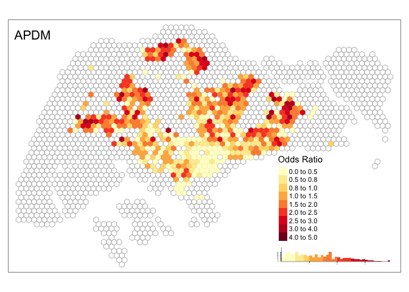
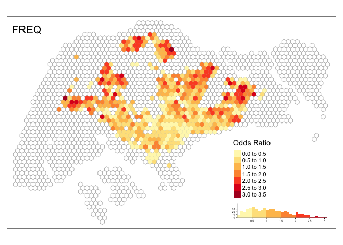
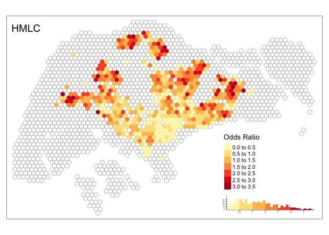
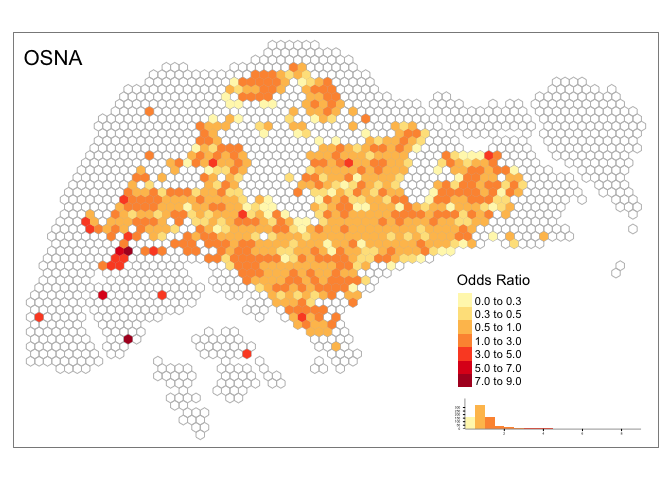

Spatial comparison of four approaches
================

## Load dataset

### Load grid cells

``` r
#grids 
grids <- readRDS(here("analysis/data/derived_data/grid_750.rds"))
head(grids)
```

    ## Simple feature collection with 6 features and 1 field
    ## geometry type:  POLYGON
    ## dimension:      XY
    ## bbox:           xmin: 15792.54 ymin: 15315.71 xmax: 18417.54 ymax: 17480.77
    ## CRS:            EPSG:3414
    ##   grid_id                              .
    ## 1       1 POLYGON ((17292.54 15965.23...
    ## 2       2 POLYGON ((16917.54 16614.75...
    ## 3       3 POLYGON ((17667.54 16614.75...
    ## 4       4 POLYGON ((15792.54 17264.27...
    ## 5       5 POLYGON ((16542.54 17264.27...
    ## 6       6 POLYGON ((17292.54 17264.27...

### Load de-identified dataset

``` r
#de-identified dataset 
df <- readRDS(here("analysis/data/derived_data/data_anonymized.rds"))
head(df)
```

    ## # A tibble: 6 x 3
    ##   u_id     created_at          grid_id
    ##   <chr>    <dttm>                <int>
    ## 1 91936517 2012-09-13 22:25:29     847
    ## 2 84741080 2014-09-02 15:06:17     849
    ## 3 6853424  2013-02-28 21:40:09    1298
    ## 4 87242469 2014-09-22 10:56:12     747
    ## 5 41544838 2012-11-25 17:56:41    1319
    ## 6 87701679 2014-02-09 06:04:24    1075

### Load inferred home locations

``` r
#load inferred home locations of four approaches 
hm_apdm <- readRDS(here("analysis/data/derived_data/hm_apdm.rds")) %>% mutate(name = "APDM")
hm_freq <- readRDS(here("analysis/data/derived_data/hm_freq.rds")) %>% mutate(name = "FREQ")
hm_hmlc <- readRDS(here("analysis/data/derived_data/hm_hmlc.rds")) %>% mutate(name = "HMLC")
hm_osna <- readRDS(here("analysis/data/derived_data/hm_osna.rds")) %>% mutate(name = "OSNA")
hm_all <- bind_rows(hm_apdm, hm_freq, hm_hmlc, hm_osna)
head(hm_all)
```

    ## # A tibble: 6 x 3
    ##   u_id     home  name 
    ##   <chr>    <chr> <chr>
    ## 1 52426211 849   APDM 
    ## 2 67154109 1852  APDM 
    ## 3 378636   1126  APDM 
    ## 4 12273017 1067  APDM 
    ## 5 13647376 1475  APDM 
    ## 6 61604221 759   APDM

### Calculate odds ratio

``` r
cal_OR <- function(df_hm, df, grids){
  #number of users with inferred homes at each grid
  df_locals_grid <- df_hm %>% 
      group_by(home) %>% 
      summarise(n_locals_grid = n_distinct(u_id))
  
  #grids that have fewer than 5 home users 
  grids_fewer5hm <- df_locals_grid %>% 
      filter(n_locals_grid < 5) %>% 
      pull(home)
  
  #users in grids that have fewer than 5 home users 
  users_in_grids_fewer5hm <- df_hm %>% 
      filter(home %in% grids_fewer5hm) %>% 
      pull(u_id) 
  
  #remove those users from inferred home dataset 
  df_hm_updated <- df_hm %>% filter(!u_id %in% users_in_grids_fewer5hm)
  
  #number of users with inferred homes at each grid
  df_locals_grids <- df_hm_updated %>% 
    group_by(home) %>% 
    summarise(n_locals_grid = n_distinct(u_id))
  
  #remove those users from de-identified dataset 
  df_updated <- df %>% filter(!u_id %in% users_in_grids_fewer5hm)
  
  df_users_grids <- df_updated %>% 
    dplyr::select(u_id, grid_id) %>% 
    unique()
  
  #calculate Odds Ratio
  df_OR <- df_users_grids %>% 
    left_join(., (df_hm_updated %>% select(-name)), by = c("u_id" = "u_id")) %>% 
    replace(., is.na(.), "0") %>% 
    mutate(type = if_else(grid_id == home, "local", "visitor")) %>% 
    group_by(grid_id, type) %>% 
    dplyr::summarise(n_user = n_distinct(u_id)) %>% 
    spread(key = "type", value = "n_user") %>% 
    replace(., is.na(.), 0) %>% 
    ungroup() %>% 
    filter(grid_id %in% df_hm_updated$home) %>% 
    mutate(total_local = sum(local), 
           total_visitor = sum(visitor)) %>% 
    mutate(OR = (local/total_local)/(visitor/total_visitor)) %>% 
    left_join(., grids) %>% 
    st_as_sf()
  return(df_OR)
}
```

The calculated odds ratios are in `analysis/data/derived_data`.

``` r
#APDM
if(file.exists(here("analysis/data/derived_data/OR_apdm.rds"))){
  OR_apdm <- readRDS(here("analysis/data/derived_data/OR_apdm.rds"))
} else{
  OR_apdm <- cal_OR(hm_apdm, df, grids)
  saveRDS(OR_apdm, file = here("analysis/data/derived_data/OR_apdm.rds"))
}

#FREQ
if(file.exists(here("analysis/data/derived_data/OR_freq.rds"))){
  OR_freq <- readRDS(here("analysis/data/derived_data/OR_freq.rds"))
} else{
  OR_freq <- cal_OR(hm_freq, df, grids)
  saveRDS(OR_freq, file = here("analysis/data/derived_data/OR_freq.rds"))
}

#HMLC
if(file.exists(here("analysis/data/derived_data/OR_hmlc.rds"))){
  OR_hmlc <- readRDS(here("analysis/data/derived_data/OR_hmlc.rds"))
} else{
  OR_hmlc <- cal_OR(hm_hmlc, df, grids)
  saveRDS(OR_hmlc, file = here("analysis/data/derived_data/OR_hmlc.rds"))
}


#OSNA
if(file.exists(here("analysis/data/derived_data/OR_osna.rds"))){
  OR_osna <- readRDS(here("analysis/data/derived_data/OR_osna.rds"))
} else{
  OR_osna <- cal_OR(hm_osna, df, grids)
  saveRDS(OR_osna, file = here("analysis/data/derived_data/OR_osna.rds"))
}
```

### Geospatial distribution of inferred home locations

``` r
spatial_view <- function(grids, df_OR, n = 8, method_nm, breaks){
  tm_shape(grids) +
  tm_borders(col = "grey") +
  tm_shape(df_OR) +
  tm_fill("OR", 
          palette = "YlOrRd",
          style = "fixed",
          breaks = breaks,
          legend.hist = TRUE,
          title = "Odds Ratio") +
  tm_layout(title = method_nm,
            title.position = c("left", "top"),
            legend.outside = F,
            legend.position = c("right", "bottom"),
            legend.hist.height = 0.1,
            legend.hist.width = 0.3,
            legend.hist.size = 0.5)
}
```

#### APDM

``` r
spatial_view(grids, OR_apdm, method_nm = "APDM", breaks = c(0, 0.5, 1, 1.5, 2, 2.5, 3, 3.5))
```

<!-- -->

#### FREQ

``` r
spatial_view(grids, OR_freq, method_nm = "FREQ", breaks = c(0, 0.5, 1, 1.5, 2, 2.5, 3, 3.5))
```

<!-- -->

#### HMLC

``` r
spatial_view(grids, OR_hmlc, method_nm = "HMLC", breaks = c(0, 0.5, 1, 1.5, 2, 2.5, 3, 3.5))
```

<!-- -->

#### OSNA

``` r
spatial_view(grids, OR_osna, method_nm = "OSNA", breaks = c(0, 0.3, 0.5, 1, 3, 5, 7, 9))
```

<!-- -->
