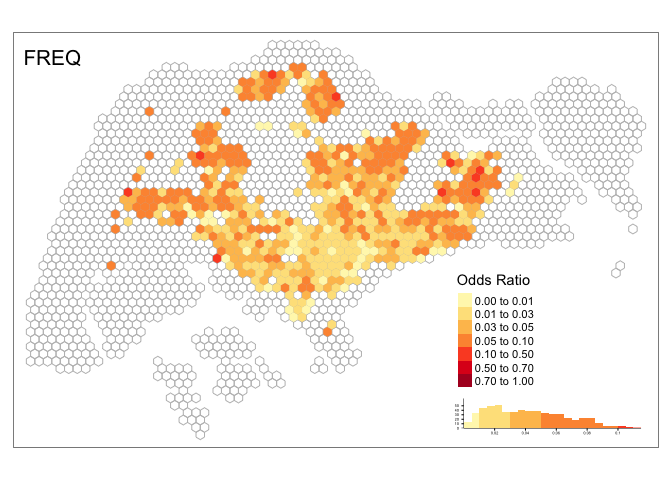

Spatial comparison of four approaches
================
Chen Qingqing
7/20/2020

## Load dataset

### Load grid cells

``` r
#grids 
grids <- readRDS(here("analysis/data/derived_data/grid_750.rds"))
head(grids)
```

    ## Simple feature collection with 6 features and 1 field
    ## geometry type:  POLYGON
    ## dimension:      XY
    ## bbox:           xmin: 15792.54 ymin: 15315.71 xmax: 18417.54 ymax: 17480.77
    ## CRS:            EPSG:3414
    ##   grid_id                              .
    ## 1       1 POLYGON ((17292.54 15965.23...
    ## 2       2 POLYGON ((16917.54 16614.75...
    ## 3       3 POLYGON ((17667.54 16614.75...
    ## 4       4 POLYGON ((15792.54 17264.27...
    ## 5       5 POLYGON ((16542.54 17264.27...
    ## 6       6 POLYGON ((17292.54 17264.27...

### Load de-identified dataset

``` r
#de-identified dataset 
df <- readRDS(here("analysis/data/derived_data/data_anonymized.rds"))
head(df)
```

    ## # A tibble: 6 x 3
    ##   u_id     created_at          grid_id
    ##   <chr>    <dttm>                <int>
    ## 1 52426211 2012-08-03 14:51:15     848
    ## 2 52426211 2012-10-06 12:50:00     848
    ## 3 52426211 2012-11-11 19:04:50     848
    ## 4 52426211 2013-01-07 13:20:33     848
    ## 5 52426211 2012-07-29 13:09:42     848
    ## 6 52426211 2012-12-14 05:00:45     848

### Load inferred home locations

``` r
#load inferred home locations of four approaches 
hm_apdm <- readRDS(here("analysis/data/derived_data/hm_apdm.rds")) %>% mutate(name = "APDM")
hm_freq <- readRDS(here("analysis/data/derived_data/hm_freq.rds")) %>% mutate(name = "FREQ")
hm_hmlc <- readRDS(here("analysis/data/derived_data/hm_hmlc.rds")) %>% mutate(name = "HMLC")
hm_osna <- readRDS(here("analysis/data/derived_data/hm_osna.rds")) %>% mutate(name = "OSNA")
hm_all <- bind_rows(hm_apdm, hm_freq, hm_hmlc, hm_osna)
head(hm_all)
```

    ## # A tibble: 6 x 3
    ##   u_id      home name 
    ##   <chr>    <int> <chr>
    ## 1 52426211   849 APDM 
    ## 2 67154109  1852 APDM 
    ## 3 378636    1126 APDM 
    ## 4 12273017  1067 APDM 
    ## 5 13647376  1475 APDM 
    ## 6 61604221   759 APDM

### Calculate odds ratio

``` r
cal_OR <- function(df_home, df_tweets, grids, method_nm){
  #number of home users in each grid 
  hm_users_grid <- df_home %>% 
    group_by(home) %>% 
    summarise(n_hm_user_grid = n_distinct(u_id))

  #grids that have fewer than 5 home users 
  grids_scarce_hm <- hm_users_grid %>% 
    filter(n_hm_user_grid < 5) %>% 
    pull(home)

  #users in grids that have fewer than 5 home users 
  users_in_grids_scarce_hm <- df_home %>% 
    filter(home %in% grids_scarce_hm) %>% 
    pull(u_id) 

  #remove those users from inferred home dataset 
  df_hm_updated <- df_home %>% filter(!u_id %in% users_in_grids_scarce_hm)
  hm_users_sg <- n_distinct(df_hm_updated$u_id) # total number of inferred homes in Singapore
  hm_users_grids <- df_hm_updated %>% # total number of inferred homes at each grid
    group_by(home) %>% 
    summarise(n_hm_users_grid = n_distinct(u_id))

  #remove those users from de-identified dataset 
  df_tweets_updated <- df_tweets %>% filter(!u_id %in% users_in_grids_scarce_hm)
  all_users_sg <- n_distinct(df_tweets_updated$u_id)
  all_users_grids <- df_tweets_updated %>% 
    dplyr::select(u_id, grid_id) %>% 
    unique() %>% 
    group_by(grid_id) %>%
    summarise(n_all_users_grid = n_distinct(u_id))
  
  df_odds_ratio <-  hm_users_grids %>% 
    left_join(., all_users_grids, by = c("home" = "grid_id")) %>%
    mutate(OR = (n_hm_users_grid/hm_users_sg)/(n_all_users_grid/all_users_sg),
           method = method_nm) %>% 
    left_join(., grids, by = c("home" = "grid_id")) %>%
    dplyr::rename(geometry = ".") %>% 
    st_as_sf()
  return(df_odds_ratio)
}
```

The calculated odds ratios are in `analysis/data/derived_data`.

``` r
#APDM
if(file.exists(here("analysis/data/derived_data/OR_apdm.rds"))){
  OR_apdm <- readRDS(here("analysis/data/derived_data/OR_apdm.rds"))
} else{
  OR_apdm <- cal_OR(hm_apdm, df, grids, method_nm = "APDM")
  saveRDS(OR_apdm, file = here("analysis/data/derived_data/OR_apdm.rds"))
}

#FREQ
if(file.exists(here("analysis/data/derived_data/OR_freq.rds"))){
  OR_freq <- readRDS(here("analysis/data/derived_data/OR_freq.rds"))
} else{
  OR_freq <- cal_OR(hm_freq, df, grids, method_nm = "FREQ")
  saveRDS(OR_freq, file = here("analysis/data/derived_data/OR_freq.rds"))
}

#HMLC
if(file.exists(here("analysis/data/derived_data/OR_hmlc.rds"))){
  OR_hmlc <- readRDS(here("analysis/data/derived_data/OR_hmlc.rds"))
} else{
  OR_hmlc <- cal_OR(hm_hmlc, df, grids, method_nm = "HMLC")
  saveRDS(OR_hmlc, file = here("analysis/data/derived_data/OR_hmlc.rds"))
}


#OSNA
if(file.exists(here("analysis/data/derived_data/OR_osna.rds"))){
  OR_osna <- readRDS(here("analysis/data/derived_data/OR_osna.rds"))
} else{
  OR_osna <- cal_OR(hm_osna, df, grids, method_nm = "OSNA")
  saveRDS(OR_osna, file = here("analysis/data/derived_data/OR_osna.rds"))
}
```

### Geospatial distribution of inferred home locations

``` r
spatial_view <- function(grids, df_OR, method_nm){
  tm_shape(grids) +
  tm_borders(col = "grey") +
  tm_shape(df_OR) +
  tm_fill("OR", 
          palette = "YlOrRd",
          style = "fixed",
          breaks = c(0, 0.01, 0.03, 0.05, 0.1, 0.5, 0.7, 1.0),
          legend.hist = TRUE,
          title = "Odds Ratio") +
  tm_layout(title = method_nm,
            title.position = c("left", "top"),
            legend.outside = F,
            legend.position = c("right", "bottom"),
            legend.hist.height = 0.1,
            legend.hist.width = 0.3,
            legend.hist.size = 0.5)
}
```

#### APDM

``` r
spatial_view(grids, OR_apdm, method_nm = "APDM")
```

<!-- -->

#### FREQ

``` r
spatial_view(grids, OR_freq, method_nm = "FREQ")
```

<!-- -->

#### HMLC

``` r
spatial_view(grids, OR_hmlc, method_nm = "HMLC")
```

<!-- -->

#### OSNA

``` r
spatial_view(grids, OR_osna, method_nm = "OSNA")
```

<!-- -->
