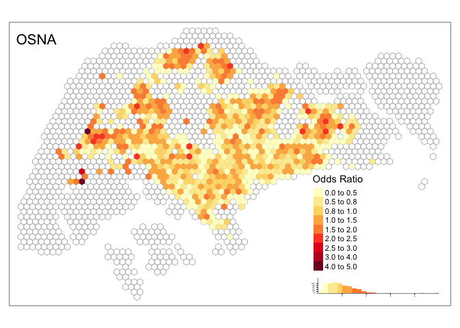

Spatial comparison of four approaches
================

## Load dataset

### Load grid cells

``` r
#grids 
grids <- st_read(here("analysis/data/derived_data/spatial_hex_grid.shp"), quiet = T) %>% 
  st_transform(crs = 3414)
head(grids)
```

    ## Simple feature collection with 6 features and 1 field
    ## geometry type:  POLYGON
    ## dimension:      XY
    ## bbox:           xmin: 2292.538 ymin: 21810.9 xmax: 3417.538 ymax: 27873.08
    ## projected CRS:  SVY21 / Singapore TM
    ##   grid_id                       geometry
    ## 1       1 POLYGON ((2667.538 21810.9,...
    ## 2       2 POLYGON ((2667.538 23109.94...
    ## 3       3 POLYGON ((2667.538 24408.98...
    ## 4       4 POLYGON ((2667.538 25708.01...
    ## 5       5 POLYGON ((2667.538 27007.05...
    ## 6       6 POLYGON ((3042.538 22460.42...

### Load de-identified dataset

``` r
#de-identified dataset 
df <- read_csv(here("analysis/data/derived_data/deidentified_sg_tweets.csv")) %>% 
  mutate(created_at = with_tz(created_at, tzone = "Asia/Singapore")) # the tweets were sent in Singapore, so must convert the timezone to SGT, the default timezone is UTC! 
head(df)
```

    ## # A tibble: 6 x 3
    ##       u_id created_at          grid_id
    ##      <dbl> <dttm>                <dbl>
    ## 1 83048769 2015-04-21 10:31:49     695
    ## 2 83048769 2015-02-23 20:09:00     734
    ## 3 83048769 2015-03-04 21:25:37     734
    ## 4 83048769 2015-03-08 19:47:42     734
    ## 5 83048769 2015-03-02 20:57:27     734
    ## 6 83048769 2015-04-16 19:35:37     734

### Load inferred home locations

``` r
#load inferred home locations of four approaches 
hm_apdm <- read_csv(here("analysis/data/derived_data/hm_apdm.csv"))
hm_freq <- read_csv(here("analysis/data/derived_data/hm_freq.csv"))
hm_hmlc <- read_csv(here("analysis/data/derived_data/hm_hmlc.csv"))
hm_osna <- read_csv(here("analysis/data/derived_data/hm_osna.csv"))
hm_all <- bind_rows(hm_apdm, hm_freq, hm_hmlc, hm_osna)
head(hm_all)
```

    ## # A tibble: 6 x 3
    ##       u_id  home name 
    ##      <dbl> <dbl> <chr>
    ## 1 42151437  1622 APDM 
    ## 2 44523269   962 APDM 
    ## 3 71380694  1449 APDM 
    ## 4 59406560   559 APDM 
    ## 5 97357036  1394 APDM 
    ## 6 80510132  1101 APDM

### Calculate odds ratio

The calculated odds ratios are in `analysis/data/derived_data`.

``` r
#APDM
if(file.exists(here("analysis/data/derived_data/OR_apdm.csv"))){
  OR_apdm <- read_csv(here("analysis/data/derived_data/OR_apdm.csv"))
} else{
  OR_apdm <- cal_OR(hm_apdm, df, grids)
  write_csv(OR_apdm, path = here("analysis/data/derived_data/OR_apdm.csv"))
}

#FREQ
if(file.exists(here("analysis/data/derived_data/OR_freq.csv"))){
  OR_freq <- read_csv(here("analysis/data/derived_data/OR_freq.csv"))
} else{
  OR_freq <- cal_OR(hm_freq, df, grids)
  write_csv(OR_freq, path = here("analysis/data/derived_data/OR_freq.csv"))
}

#HMLC
if(file.exists(here("analysis/data/derived_data/OR_hmlc.csv"))){
  OR_hmlc <- read_csv(here("analysis/data/derived_data/OR_hmlc.csv"))
} else{
  OR_hmlc <- cal_OR(hm_hmlc, df, grids)
  write_csv(OR_hmlc, path = here("analysis/data/derived_data/OR_hmlc.csv"))
}


#OSNA
if(file.exists(here("analysis/data/derived_data/OR_osna.csv"))){
  OR_osna <- read_csv(here("analysis/data/derived_data/OR_osna.csv"))
} else{
  OR_osna <- cal_OR(hm_osna, df, grids)
  write_csv(OR_osna, path = here("analysis/data/derived_data/OR_osna.csv"))
}

## convert to sf object
OR_apdm <- OR_apdm %>% left_join(., grids) %>% st_as_sf()
OR_freq <- OR_freq %>% left_join(., grids) %>% st_as_sf()
OR_hmlc <- OR_hmlc %>% left_join(., grids) %>% st_as_sf()
OR_osna <- OR_osna %>% left_join(., grids) %>% st_as_sf()
```

### Geospatial distribution of inferred home locations

#### APDM

``` r
spatial_view(grids, OR_apdm, method_nm = "APDM", breaks = c(0, 0.5, 0.8, 1, 1.5, 2, 2.5, 3, 4, 5))
```

<!-- -->

#### FREQ

``` r
spatial_view(grids, OR_freq, method_nm = "FREQ", breaks = c(0, 0.5, 0.8, 1, 1.5, 2, 2.5, 3, 4, 5))
```

<!-- -->

#### HMLC

``` r
spatial_view(grids, OR_hmlc, method_nm = "HMLC", breaks = c(0, 0.5, 0.8, 1, 1.5, 2, 2.5, 3, 4, 5))
```

<!-- -->

#### OSNA

``` r
spatial_view(grids, OR_osna, method_nm = "OSNA", breaks = c(0, 0.5, 0.8, 1, 1.5, 2, 2.5, 3, 4, 5))
```

<!-- -->
