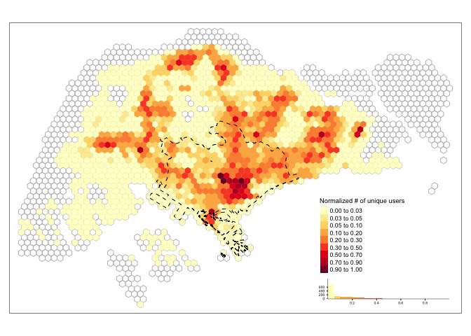

Spatial views
================

## Load dataset

``` r
#load de-identified dataset
df <- readRDS(here("analysis/data/derived_data/data_anonymized.rds"))

#load grid cells 
grids <- readRDS(here("analysis/data/derived_data/grid_750.rds"))

#load central region 
df_central_region <- read_sf(here("analysis/data/raw_data/central_region/central_region.shp")) 

#load inferred home locations 
hm_apdm <- readRDS(here("analysis/data/derived_data/hm_apdm.rds")) %>% mutate(name = "APDM")
hm_freq <- readRDS(here("analysis/data/derived_data/hm_freq.rds")) %>% mutate(name = "FREQ")
hm_hmlc <- readRDS(here("analysis/data/derived_data/hm_hmlc.rds")) %>% mutate(name = "HMLC")
hm_osna <- readRDS(here("analysis/data/derived_data/hm_osna.rds")) %>% mutate(name = "OSNA")
hm_all <- bind_rows(hm_apdm, hm_freq, hm_hmlc, hm_osna)
head(hm_all)
```

    ## # A tibble: 6 x 3
    ##   u_id     home  name 
    ##   <chr>    <chr> <chr>
    ## 1 52426211 849   APDM 
    ## 2 67154109 1852  APDM 
    ## 3 378636   1126  APDM 
    ## 4 12273017 1067  APDM 
    ## 5 13647376 1475  APDM 
    ## 6 61604221 759   APDM

## Spatial views

### Users with inferred home locations that all four approaches agree

``` r
# users with inferred home locations that all four approaches agree
same_hm_users <- hm_all %>% 
  group_by(u_id) %>% 
  dplyr::summarise(n_methods = n_distinct(name),
                   n_homes = n_distinct(home)) %>% 
  filter(n_methods == 4 & n_homes == 1) %>% 
  pull(u_id)
```

### Normalization

``` r
df_tweets_same_hm_users <- df %>% filter(u_id %in% same_hm_users)

#normalized number of tweets 
norm_tweets <- df_tweets_same_hm_users %>% 
  group_by(grid_id) %>% 
  dplyr::summarise(n_tweets = n()) %>% 
  mutate(norm_n_tweets = (n_tweets - min(n_tweets))/(max(n_tweets)-min(n_tweets))) %>% 
  inner_join(., grids) %>% 
  st_as_sf()

#normalized number of users 
norm_users <- df_tweets_same_hm_users %>% 
  group_by(grid_id) %>%
  summarise(n_users = n_distinct(u_id)) %>% 
  mutate(norm_n_users = (n_users - min(n_users))/(max(n_users)-min(n_users))) %>% 
  inner_join(., grids) %>% 
  st_as_sf()

#normalized number of inferred homes
hm_same_users <- hm_all %>% 
  filter(u_id %in% same_hm_users) %>% 
  dplyr::select(-name) %>% 
  unique()

norm_home_users <- hm_same_users %>% 
  mutate(home = as.numeric(home)) %>% 
  group_by(home) %>% 
  summarise(n_users_home = n_distinct(u_id)) %>% 
  mutate(norm_n_users_home = (n_users_home - min(n_users_home))/(max(n_users_home)-min(n_users_home))) %>%
  left_join(., grids, by = c("home" = "grid_id")) %>% 
  st_as_sf() 
```

### Residents in Singapore 2015

``` r
#residents in Singapore 2015
pop2015 <- read_sf(here("analysis/data/raw_data/pop2015/PLAN_BDY_DWELLING_TYPE_2015.shp")) %>%
  st_transform(., crs = 3414) %>% 
  st_make_valid()
```

### Geographical distribution of number of tweets (normalized)

``` r
map_view <- function(grids, df_normalized, var_fill, df_central, legend.nm, show_central = F){
  tm_basic <- tm_shape(grids) + 
    tm_borders(col = "grey") + 
    tm_shape(df_normalized) +
    tm_fill(var_fill, 
            palette = "YlOrRd",
            n = 8, style = "fisher", 
            legend.hist = TRUE,
            title = legend.nm)
  
  tm_adjust <- tm_layout(title.position = c("left", "top"),
            title.size = 0.7,
            legend.outside = F,
            legend.position = c("right", "bottom"),
            legend.title.size  = 0.7,
            legend.text.size = 0.55,
            legend.hist.height = 0.1,
            legend.hist.width = 0.3,
            legend.hist.size = 0.5)
  if(show_central){
    tm_basic + 
      tm_shape(df_central) + 
      tm_borders(col = "black", lty = 2) +
      tm_adjust
  } else{
    tm_basic +
      tm_adjust
  }
}
```

``` r
map_view(grids, norm_tweets, var_fill = "norm_n_tweets", legend.nm = "Normalized # of tweets")
```



### Geographical distribution of number of unique users (normalized)

``` r
map_view(grids, norm_users, var_fill = "norm_n_users", df_central_region, legend.nm = "Normalized # of unique users", show_central = T)
```


### Geographical distribution of number of inferred home locations (normalized)

``` r
map_view(grids, norm_home_users, var_fill = "norm_n_users_home", legend.nm = "Normalized # of inferred homes")
```


### Geographical distribution of number of residents

``` r
map_view(grids, pop2015, var_fill = "TOTAL", legend.nm = "Normalized # of residents")
```


