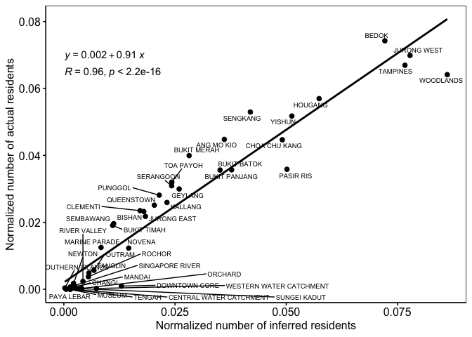

The correlation between inferred residents and actual residents
================

## Residents in Singapore 2015

``` r
#residents in Singapore 2015
pop2015 <- st_read(here("analysis/data/raw_data/PLAN_BDY_DWELLING_TYPE_2015.shp"), quiet = T) %>%
  st_transform(., crs = 3414) %>% 
  st_make_valid()
```

## Inferred home locations

``` r
#load grid cells 
grids <- st_read(here("analysis/data/derived_data/spatial_hex_grid.shp"), quiet = T) %>% 
  st_transform(crs = 3414)

#load inferred home locations 
hm_apdm <- read_csv(here("analysis/data/derived_data/hm_apdm.csv")) %>% mutate(name = "APDM")
hm_freq <- read_csv(here("analysis/data/derived_data/hm_freq.csv")) %>% mutate(name = "FREQ")
hm_hmlc <- read_csv(here("analysis/data/derived_data/hm_hmlc.csv")) %>% mutate(name = "HMLC")
hm_osna <- read_csv(here("analysis/data/derived_data/hm_osna.csv")) %>% mutate(name = "OSNA")
hm_all <- bind_rows(hm_apdm, hm_freq, hm_hmlc, hm_osna)
```

## Users with inferred homes that all four approaches agree

``` r
# users with inferred home locations that all four approaches agree
same_hm_users <- hm_all %>% 
  group_by(u_id) %>% 
  dplyr::summarise(n_methods = n_distinct(name),
                   n_homes = n_distinct(home)) %>% 
  filter(n_methods == 4 & n_homes == 1) %>% 
  pull(u_id)

hm_same_users <- hm_all %>% 
  mutate(home = as.numeric(home)) %>% 
  filter(u_id %in% same_hm_users) %>% 
  dplyr::select(-name) %>% 
  unique() %>% 
  left_join(., grids, by = c("home" = "grid_id")) %>% 
  st_as_sf()
```

## Correlation

``` r
inferred_residents <- pop2015 %>% 
  select(c(PLN_AREA_N)) %>%
  st_transform(crs = 3414) %>% 
  st_make_valid() %>% 
  st_join(hm_same_users, ., largest = T) %>% 
  st_set_geometry(NULL) %>% 
  group_by(PLN_AREA_N) %>% 
  dplyr::summarise(n_inferred_residents = n_distinct(u_id))

actual_residents <- pop2015 %>% 
  st_set_geometry(NULL) %>% 
  select(c(PLN_AREA_N, TOTAL))

norm_residents <- left_join(inferred_residents, actual_residents) %>% 
  mutate(norm_n_inferred_residents = n_inferred_residents/sum(n_inferred_residents),
         norm_n_actual_residents = TOTAL/sum(TOTAL))


ggscatter(norm_residents, x = "norm_n_inferred_residents", y = "norm_n_actual_residents",
          add = "reg.line") +
  stat_cor(label.y = 0.065) +
  stat_regline_equation(label.y = 0.07) + 
  ggrepel::geom_text_repel(aes(label=PLN_AREA_N), size = 2.5) +
  theme(panel.background=element_rect(fill = "white", colour = "black")) + 
  labs(x = "Normalized number of inferred residents",
       y = "Normalized number of actual residents")
```


