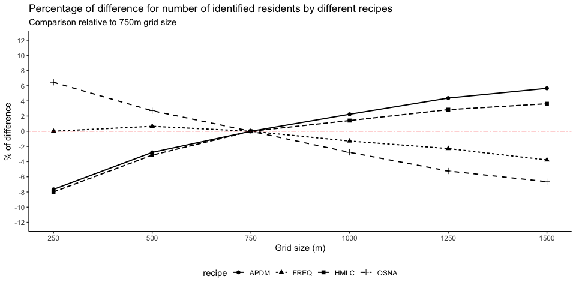
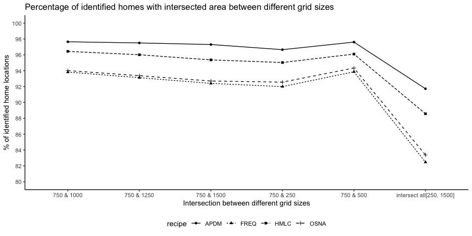

Sensitivity analysis
================

To conduct the sensitivity analysis, we create a series of different
grids with cell sizes ranging from 250m to 1500m hexagonal grid cells
with 250m intervals. The results are quite interesting and show that the
resolution has a relatively limited impact on the resulting home
location analysis. Unsurprisingly, more ‘stringent’ algorithms *APDM*
and *HMLC* see an increase in the number of identified homes/users as
the cell size increases. Nonetheless, the difference in the number of
identified homes between the smallest and the largest resolution is just
2-3 percentage points on average.

To compare the consistency of the identified home locations across
different resolutions, we also analyse the spatial intersection of
identified home locations between 750m and other grid cell sizes, as
well as the spatial intersection across all grid sizes. We labelled two
identified homes the same if they are intersecting each other,
otherwise, we labelled them the two different locations. The results
show that there is a high percentage (\> 90%) of spatial intersections
(i.e. same identified home locations) between 750m grid cell size and
other grid cell sizes. As such, the resolution impact of the spatial
unit is relatively small for the specific case of Singapore.

## Create different grid cell sizes

``` r
basic_path <- "/analysis/appendix/data/sensitivity_test/"
```

``` r
create_grids <- function(grid.size){
  sg_boundary <- read_sf(here("analysis/data/raw_data/MP14_SUBZONE_NO_SEA_PL.shp")) %>%
    st_transform(crs = 3414) %>%
    st_make_valid()
  
  # make hexagonal grids base on cellsize 
  sg_boundary %>%
    st_make_grid(., cellsize = grid.size, square = F) %>%
    st_sf() %>%
    rowid_to_column("grid_id")
}
# 250m
if(file.exists(paste0(here(), basic_path, "grids250.rds"))){
  grids250 <- readRDS(paste0(here(), basic_path, "grids250.rds"))
}else{
  grids250 <- create_grids(grid.size = 250)
  saveRDS(grids250, file = paste0(here(), basic_path, "grids250.rds"))
}
# 500m
if(file.exists(paste0(here(), basic_path, "grids500.rds"))){
  grids500 <- readRDS(paste0(here(), basic_path, "grids500.rds"))
}else{
  grids500 <- create_grids(grid.size = 500)
  saveRDS(grids500, file = paste0(here(), basic_path, "grids500.rds"))
}
# 750m
if(file.exists(paste0(here(), basic_path, "grids750.rds"))){
  grids750 <- readRDS(paste0(here(), basic_path, "grids750.rds"))
}else{
  grids750 <- create_grids(grid.size = 750)
  saveRDS(grids750, file = paste0(here(), basic_path, "grids750.rds"))
}
# 1000m
if(file.exists(paste0(here(), basic_path, "grids1000.rds"))){
  grids1000 <- readRDS(paste0(here(), basic_path, "grids1000.rds"))
}else{
  grids1000 <- create_grids(grid.size = 1000)
  saveRDS(grids1000, file = paste0(here(), basic_path, "grids1000.rds"))
}
# 1250m
if(file.exists(paste0(here(), basic_path, "grids1250.rds"))){
  grids1250 <- readRDS(paste0(here(), basic_path, "grids1250.rds"))
}else{
  grids1250 <- create_grids(grid.size = 1250)
  saveRDS(grids1250, file = paste0(here(), basic_path, "grids1250.rds"))
}
# 1500m
if(file.exists(paste0(here(), basic_path, "grids1500.rds"))){
  grids1500 <- readRDS(paste0(here(), basic_path, "grids1500.rds"))
}else{
  grids1500 <- create_grids(grid.size = 1500)
  saveRDS(grids1500, file = paste0(here(), basic_path, "grids1500.rds"))
}
```

## Aggregate twitter points to grids by different grid cell sizes

``` r
# load dataset
df.tb <- readRDS(here("analysis/appendix/sensitivity_test/sg_tweets.rds")) %>% as.data.table()
# aggregate twitter points to grids
point2grid <- function(df_grids){
  df.tb %>%
    st_as_sf(., coords = c("lon", "lat"), crs = 4326) %>%
    st_transform(crs = 3414) %>%
    st_join(., df_grids) %>%
    st_set_geometry(NULL)
}

# 250m
if(file.exists(paste0(here(), basic_path, "df_250.rds"))){
  df_250 <- readRDS(paste0(here(), basic_path, "df_250.rds"))
}else{
  df_250 <- point2grid(grids250)
  saveRDS(df_250, file = paste0(here(), basic_path, "df_250.rds"))
}

# 500m
if(file.exists(paste0(here(), basic_path, "df_500.rds"))){
  df_500 <- readRDS(paste0(here(), basic_path, "df_500.rds"))
}else{
  df_500 <- point2grid(grids500)
  saveRDS(df_500, file = paste0(here(), basic_path, "df_500.rds"))
}

# 750m
if(file.exists(paste0(here(), basic_path, "df_750.rds"))){
  df_750 <- readRDS(paste0(here(), basic_path, "df_750.rds"))
}else{
  df_750 <- point2grid(grids750)
  saveRDS(df_750, file = paste0(here(), basic_path, "df_750.rds"))
}

# 1000m
if(file.exists(paste0(here(), basic_path, "df_1000.rds"))){
  df_1000 <- readRDS(paste0(here(), basic_path, "df_1000.rds"))
}else{
  df_1000 <- point2grid(grids1000)
  saveRDS(df_1000, file = paste0(here(), basic_path, "df_1000.rds"))
}

# 1250m
if(file.exists(paste0(here(), basic_path, "df_1250.rds"))){
  df_1250 <- readRDS(paste0(here(), basic_path, "df_1250.rds"))
}else{
  df_1250 <- point2grid(grids1250)
  saveRDS(df_1250, file = paste0(here(), basic_path, "df_1250.rds"))
}

# 1500m
if(file.exists(paste0(here(), basic_path, "df_1500.rds"))){
  df_1500 <- readRDS(paste0(here(), basic_path, "df_1500.rds"))
}else{
  df_1500 <- point2grid(grids1500)
  saveRDS(df_1500, file = paste0(here(), basic_path, "df_1500.rds"))
}
```

## Identify home locations

### 250m grid cells

``` r
# functions used for generate neighbours 
st_queen <- function(a, b = a) st_relate(a, b, pattern = "F***T****")
#convert list to tibble
list_to_tibble <- function(index, neighbors){
  tibble(grid_id = as.character(index)) %>%
    mutate(neighbor = list(neighbors[[index]]))
}

### 250m 
df_250 <- df_250 %>% 
  dplyr::select(u_id, created_at_sg, grid_id) %>%
  dplyr::rename(created_at = created_at_sg)


# recipe: hmlc
if(file.exists(paste0(here(), basic_path, "hm250_hmlc.rds"))){
  hm250_hmlc <- readRDS(paste0(here(), basic_path, "hm250_hmlc.rds"))
}else{
  hm250_hmlc <- identify_location(df_250, user = "u_id", timestamp = "created_at", location = "grid_id", tz = "Asia/Singapore", show_n_loc = 1, keep_score = F, recipe = "HMLC")
  saveRDS(hm250_hmlc, file = paste0(here(), basic_path, "hm250_hmlc.rds"))
}

# recipe: freq
if(file.exists(paste0(here(), basic_path, "hm250_freq.rds"))){
  hm250_freq <- readRDS(paste0(here(), basic_path, "hm250_freq.rds"))
}else{
  hm250_freq <- identify_location(df_250, user = "u_id", timestamp = "created_at", location = "grid_id", tz = "Asia/Singapore", show_n_loc = 1, keep_score = F, recipe = "FREQ")
  saveRDS(hm250_freq, file = paste0(here(), basic_path, "hm250_freq.rds"))
}

# recipe: osna
if(file.exists(paste0(here(), basic_path, "hm250_osna.rds"))){
  hm250_osna <- readRDS(paste0(here(), basic_path, "hm250_osna.rds"))
}else{
  hm250_osna <- identify_location(df_250, user = "u_id", timestamp = "created_at", location = "grid_id", tz = "Asia/Singapore", show_n_loc = 1, keep_score = F, recipe = "OSNA")
  saveRDS(hm250_osna, file = paste0(here(), basic_path, "hm250_osna.rds"))
}

# recipe: apdm
if(file.exists(paste0(here(), basic_path, "hm250_apdm.rds"))){
  hm250_apdm <- readRDS(paste0(here(), basic_path, "hm250_apdm.rds"))
}else{
  neighbors_250m <- st_queen(grids250)
  df_neighbors <- do.call(rbind, map(1:length(neighbors_250m), function(x) list_to_tibble(x, neighbors_250m)))
  hm250_apdm <- identify_location(df_250, user = "u_id", timestamp = "created_at", location = "grid_id", tz = "Asia/Singapore", keep_score = F, recipe = "APDM")
  saveRDS(hm250_apdm, file = paste0(here(), basic_path, "hm250_apdm.rds"))
}
```

### 500m grid cells

``` r
df_500 <- df_500 %>%
  dplyr::select(u_id, created_at_sg, grid_id) %>%
  dplyr::rename(created_at = created_at_sg)

# recipe: hmlc
if(file.exists(paste0(here(), basic_path, "hm500_hmlc.rds"))){
  hm500_hmlc <- readRDS(paste0(here(), basic_path, "hm500_hmlc.rds"))
}else{
  hm500_hmlc <- identify_location(df_500, user = "u_id", timestamp = "created_at", location = "grid_id", tz = "Asia/Singapore", show_n_loc = 1, keep_score = F, recipe = "HMLC")
  saveRDS(hm500_hmlc, file = paste0(here(), basic_path, "hm500_hmlc.rds"))
}

# recipe: freq
if(file.exists(paste0(here(), basic_path, "hm500_freq.rds"))){
  hm500_freq <- readRDS(paste0(here(), basic_path, "hm500_freq.rds"))
}else{
  hm500_freq <- identify_location(df_500, user = "u_id", timestamp = "created_at", location = "grid_id", tz = "Asia/Singapore", show_n_loc = 1, keep_score = F, recipe = "FREQ")
  saveRDS(hm500_freq, file = paste0(here(), basic_path, "hm500_freq.rds"))
}

# recipe: osna
if(file.exists(paste0(here(), basic_path, "hm500_osna.rds"))){
  hm500_osna <- readRDS(paste0(here(), basic_path, "hm500_osna.rds"))
}else{
  hm500_osna <- identify_location(df_500, user = "u_id", timestamp = "created_at", location = "grid_id", tz = "Asia/Singapore", show_n_loc = 1, keep_score = F, recipe = "OSNA")
  saveRDS(hm500_osna, file = paste0(here(), basic_path, "hm500_osna.rds"))
}

# recipe: apdm
if(file.exists(paste0(here(), basic_path, "hm500_apdm.rds"))){
  hm500_apdm <- readRDS(paste0(here(), basic_path, "hm500_apdm.rds"))
}else{
  neighbors_500m <- st_queen(grids500)
  df_neighbors <- do.call(rbind, map(1:length(neighbors_500m), function(x) list_to_tibble(x, neighbors_500m)))
  hm500_apdm <- identify_location(df_500, user = "u_id", timestamp = "created_at", location = "grid_id", tz = "Asia/Singapore", keep_score = F, recipe = "APDM")
  saveRDS(hm500_apdm, file = paste0(here(), basic_path, "hm500_apdm.rds"))
}
```

### 750m grid cells

``` r
df_750 <- df_750 %>% 
  dplyr::select(u_id, created_at_sg, grid_id) %>%
  dplyr::rename(created_at = created_at_sg)

# recipe: hmlc
if(file.exists(paste0(here(), basic_path, "hm750_hmlc.rds"))){
  hm750_hmlc <- readRDS(paste0(here(), basic_path, "hm750_hmlc.rds"))
}else{
  hm750_hmlc <- identify_location(df_750, user = "u_id", timestamp = "created_at", location = "grid_id", tz = "Asia/Singapore", show_n_loc = 1, keep_score = F, recipe = "HMLC")
  saveRDS(hm750_hmlc, file = paste0(here(), basic_path, "hm750_hmlc.rds"))
}

# recipe: freq
if(file.exists(paste0(here(), basic_path, "hm750_freq.rds"))){
  hm750_freq <- readRDS(paste0(here(), basic_path, "hm750_freq.rds"))
}else{
  hm750_freq <- identify_location(df_750, user = "u_id", timestamp = "created_at", location = "grid_id", tz = "Asia/Singapore", show_n_loc = 1, keep_score = F, recipe = "FREQ")
  saveRDS(hm750_freq, file = paste0(here(), basic_path, "hm750_freq.rds"))
}

# recipe: osna
if(file.exists(paste0(here(), basic_path, "hm750_osna.rds"))){
  hm750_osna <- readRDS(paste0(here(), basic_path, "hm750_osna.rds"))
}else{
  hm750_osna <- identify_location(df_750, user = "u_id", timestamp = "created_at", location = "grid_id", tz = "Asia/Singapore", show_n_loc = 1, keep_score = F, recipe = "OSNA")
  saveRDS(hm750_osna, file = paste0(here(), basic_path, "hm750_osna.rds"))
}

# recipe: apdm
if(file.exists(paste0(here(), basic_path, "hm750_apdm.rds"))){
  hm750_apdm <- readRDS(paste0(here(), basic_path, "hm750_apdm.rds"))
}else{
  neighbors_750m <- st_queen(grids750)
  df_neighbors <- do.call(rbind, map(1:length(neighbors_750m), function(x) list_to_tibble(x, neighbors_750m)))
  hm750_apdm <- identify_location(df_750, user = "u_id", timestamp = "created_at", location = "grid_id", tz = "Asia/Singapore", keep_score = F, recipe = "APDM")
  saveRDS(hm750_apdm, file = paste0(here(), basic_path, "hm750_apdm.rds"))
}
```

### 1000m grid cells

``` r
df_1000 <- df_1000 %>%
  dplyr::select(u_id, created_at_sg, grid_id) %>%
  dplyr::rename(created_at = created_at_sg) %>% as_tibble()

# recipe: hmlc
if(file.exists(paste0(here(), basic_path, "hm1000_hmlc.rds"))){
  hm1000_hmlc <- readRDS(paste0(here(), basic_path, "hm1000_hmlc.rds"))
}else{
  hm1000_hmlc <- identify_location(df_1000, user = "u_id", timestamp = "created_at", location = "grid_id", tz = "Asia/Singapore", show_n_loc = 1, keep_score = F, recipe = "HMLC")
  saveRDS(hm1000_hmlc, file = paste0(here(), basic_path, "hm1000_hmlc.rds"))
}

# recipe: freq
if(file.exists(paste0(here(), basic_path, "hm1000_freq.rds"))){
  hm1000_freq <- readRDS(paste0(here(), basic_path, "hm1000_freq.rds"))
}else{
  hm1000_freq <- identify_location(df_1000, user = "u_id", timestamp = "created_at", location = "grid_id", tz = "Asia/Singapore", show_n_loc = 1, keep_score = F, recipe = "FREQ")
  saveRDS(hm1000_freq, file = paste0(here(), basic_path, "hm1000_freq.rds"))
}

# recipe: osna
if(file.exists(paste0(here(), basic_path, "hm1000_osna.rds"))){
  hm1000_osna <- readRDS(paste0(here(), basic_path, "hm1000_osna.rds"))
}else{
  hm1000_osna <- identify_location(df_1000, user = "u_id", timestamp = "created_at", location = "grid_id", tz = "Asia/Singapore", show_n_loc = 1, keep_score = F, recipe = "OSNA")
  saveRDS(hm1000_osna, file = paste0(here(), basic_path, "hm1000_osna.rds"))
}

# recipe: apdm
if(file.exists(paste0(here(), basic_path, "hm1000_apdm.rds"))){
  hm1000_apdm <- readRDS(paste0(here(), basic_path, "hm1000_apdm.rds"))
}else{
  neighbors_1000m <- st_queen(grids1000)
  df_neighbors <- do.call(rbind, map(1:length(neighbors_1000m), function(x) list_to_tibble(x, neighbors_1000m)))
  hm1000_apdm <- identify_location(df_1000, user = "u_id", timestamp = "created_at", location = "grid_id", tz = "Asia/Singapore", keep_score = F, recipe = "APDM")
  saveRDS(hm1000_apdm, file = paste0(here(), basic_path, "hm1000_apdm.rds"))
}
```

### 1250m grid cells

``` r
df_1250 <- df_1250 %>%
  dplyr::select(u_id, created_at_sg, grid_id) %>%
  dplyr::rename(created_at = created_at_sg)

# recipe: hmlc
if(file.exists(paste0(here(), basic_path, "hm1250_hmlc.rds"))){
  hm1250_hmlc <- readRDS(paste0(here(), basic_path, "hm1250_hmlc.rds"))
}else{
  hm1250_hmlc <- identify_location(df_1250, user = "u_id", timestamp = "created_at", location = "grid_id", tz = "Asia/Singapore", show_n_loc = 1, keep_score = F, recipe = "HMLC")
  saveRDS(hm1250_hmlc, file = paste0(here(), basic_path, "hm1250_hmlc.rds"))
}

# recipe: freq
if(file.exists(paste0(here(), basic_path, "hm1250_freq.rds"))){
  hm1250_freq <- readRDS(paste0(here(), basic_path, "hm1250_freq.rds"))
}else{
  hm1250_freq <- identify_location(df_1250, user = "u_id", timestamp = "created_at", location = "grid_id", tz = "Asia/Singapore", show_n_loc = 1, keep_score = F, recipe = "FREQ")
  saveRDS(hm1250_freq, file = paste0(here(), basic_path, "hm1250_freq.rds"))
}

# recipe: osna
if(file.exists(paste0(here(), basic_path, "hm1250_osna.rds"))){
  hm1250_osna <- readRDS(paste0(here(), basic_path, "hm1250_osna.rds"))
}else{
  hm1250_osna <- identify_location(df_1250, user = "u_id", timestamp = "created_at", location = "grid_id", tz = "Asia/Singapore", show_n_loc = 1, keep_score = F, recipe = "OSNA")
  saveRDS(hm1250_osna, file = paste0(here(), basic_path, "hm1250_osna.rds"))
}

# recipe: apdm
if(file.exists(paste0(here(), basic_path, "hm1250_apdm.rds"))){
  hm1250_apdm <- readRDS(paste0(here(), basic_path, "hm1250_apdm.rds"))
}else{
  neighbors_1250m <- st_queen(grids1250)
  df_neighbors <- do.call(rbind, map(1:length(neighbors_1250m), function(x) list_to_tibble(x, neighbors_1250m)))
  hm1250_apdm <- identify_location(df_1250, user = "u_id", timestamp = "created_at", location = "grid_id", tz = "Asia/Singapore", keep_score = F, recipe = "APDM")
  saveRDS(hm1250_apdm, file = paste0(here(), basic_path, "hm1250_apdm.rds"))
}
```

### 1500m grid cells

``` r
df_1500 <- df_1500 %>%
  dplyr::select(u_id, created_at_sg, grid_id) %>%
  dplyr::rename(created_at = created_at_sg)

# recipe: hmlc
if(file.exists(paste0(here(), basic_path, "hm1500_hmlc.rds"))){
  hm1500_hmlc <- readRDS(paste0(here(), basic_path, "hm1500_hmlc.rds"))
}else{
  hm1500_hmlc <- identify_location(df_1500, user = "u_id", timestamp = "created_at", location = "grid_id", tz = "Asia/Singapore", show_n_loc = 1, keep_score = F, recipe = "HMLC")
  saveRDS(hm1500_hmlc, file = paste0(here(), basic_path, "hm1500_hmlc.rds"))
}

# recipe: freq
if(file.exists(paste0(here(), basic_path, "hm1500_freq.rds"))){
  hm1500_freq <- readRDS(paste0(here(), basic_path, "hm1500_freq.rds"))
}else{
  hm1500_freq <- identify_location(df_1500, user = "u_id", timestamp = "created_at", location = "grid_id", tz = "Asia/Singapore", show_n_loc = 1, keep_score = F, recipe = "FREQ")
  saveRDS(hm1500_freq, file = paste0(here(), basic_path, "hm1500_freq.rds"))
}

# recipe: osna
if(file.exists(paste0(here(), basic_path, "hm1500_osna.rds"))){
  hm1500_osna <- readRDS(paste0(here(), basic_path, "hm1500_osna.rds"))
}else{
  hm1500_osna <- identify_location(df_1500, user = "u_id", timestamp = "created_at", location = "grid_id", tz = "Asia/Singapore", show_n_loc = 1, keep_score = F, recipe = "OSNA")
  saveRDS(hm1500_osna, file = paste0(here(), basic_path, "hm1500_osna.rds"))
}

# recipe: apdm
if(file.exists(paste0(here(), basic_path, "hm1500_apdm.rds"))){
  hm1500_apdm <- readRDS(paste0(here(), basic_path, "hm1500_apdm.rds"))
}else{
  neighbors_1500m <- st_queen(grids1500)
  df_neighbors <- do.call(rbind, map(1:length(neighbors_1500m), function(x) list_to_tibble(x, neighbors_1500m)))
  hm1500_apdm <- identify_location(df_1500, user = "u_id", timestamp = "created_at", location = "grid_id", tz = "Asia/Singapore", keep_score = F, recipe = "APDM")
  saveRDS(hm1500_apdm, file = paste0(here(), basic_path, "hm1500_apdm.rds"))
}
```

## Comparison identified home locations between different grid cell sizes

### Recipe: HMLC

``` r
## home files
files_hmlc <- paste0(here("analysis/appendix/data/sensitivity_test/"),
                     list.files(path = here("analysis/appendix/data/sensitivity_test/"), pattern = "0_hmlc.rds$"))
hm_hmlc <- map2_df(files_hmlc, c(1000, 1250, 1500, 250, 500, 750), function(x, y) readfile(x, y))

## identified home users by grid sizes
count_identified_users(hm_hmlc)
```

    ## # A tibble: 6 x 2
    ##    size n_user
    ##   <dbl>  <int>
    ## 1   250  23952
    ## 2   500  25213
    ## 3   750  26032
    ## 4  1000  26399
    ## 5  1250  26773
    ## 6  1500  26976

``` r
## shared users
shared_users_hmlc <- get_shared_users(hm_hmlc)

if(file.exists(paste0(here(), basic_path, "intersects_hmlc.rds"))){
  intersects_hmlc <- readRDS(paste0(here(), basic_path, "intersects_hmlc.rds"))
} else{
  ## sf objects
  hm_hmlc_sf <- do.call(bind_rows, map2(list(250, 500, 750, 1000, 1250, 1500), list(grids250, grids500, grids750, grids1000, grids1250, grids1500), function(x, y) convert2sf(x, y, hm_hmlc, shared_users_hmlc)))
  
  ## intersects between two grid cell sizes
  intersects_hmlc <- map2(rep(750, 5), c(250, 500, 1000, 1250, 1500), function(x, y) check_intersects(hm_hmlc_sf, x, y))
  
  ## intersects across all grid sizes
  intersects_allsize_hmlc <- check_allsize_intersects(hm_hmlc_sf, intersects_hmlc) %>%
    mutate(size = "all sizes")
  intersects_hmlc <- append(intersects_hmlc, list(intersects_allsize_hmlc))
  saveRDS(intersects_hmlc, file = paste0(here(), basic_path, "intersects_hmlc.rds"))
}

## check paired overlaps
map(intersects_hmlc, function(x) filter(x, intersect == TRUE)) %>%
  map_dbl(., function(x) n_distinct(x, x$u_id))
```

    ## [1] 19112 19326 19395 19309 19179 17813

### Recipe: APDM

``` r
## home files
files_apdm <- paste0(here("analysis/appendix/data/sensitivity_test/"),
                     list.files(path = here("analysis/appendix/data/sensitivity_test/"), pattern = "0_apdm.rds$"))
hm_apdm <- map2_df(files_apdm, c(1000, 1250, 1500, 250, 500, 750), function(x, y) readfile(x, y))

## identified home users by grid sizes
count_identified_users(hm_apdm)
```

    ## # A tibble: 6 x 2
    ##    size n_user
    ##   <dbl>  <int>
    ## 1   250  31831
    ## 2   500  33509
    ## 3   750  34469
    ## 4  1000  35241
    ## 5  1250  35977
    ## 6  1500  36420

``` r
## shared users
shared_users_apdm <- get_shared_users(hm_apdm)

if(file.exists(paste0(here(), basic_path, "intersects_apdm.rds"))){
  intersects_apdm <- readRDS(paste0(here(), basic_path, "intersects_apdm.rds"))
}else{
  ## sf objects
  hm_apdm_sf <- do.call(rbind, map2(list(250, 500, 750, 1000, 1250, 1500), list(grids250, grids500, grids750, grids1000, grids1250, grids1500), function(x, y) convert2sf(x, y, hm_apdm, shared_users_apdm)))
  
  ## intersects between two grid cell sizes
  intersects_apdm <- map2(rep(750, 5), c(250, 500, 1000, 1250, 1500), function(x, y) check_intersects(hm_apdm_sf, x, y))
  ## intersects across all grid sizes
  intersects_allsize_apdm <- check_allsize_intersects(hm_apdm_sf, intersects_apdm) %>%
    mutate(size = "all sizes")
  intersects_apdm <- append(intersects_apdm, list(intersects_allsize_apdm))
  saveRDS(intersects_apdm, file = paste0(here(), basic_path, "intersects_apdm.rds"))
}

### check paired overlaps
map(intersects_apdm, function(x) filter(x, intersect == TRUE)) %>%
    map_dbl(., function(x) n_distinct(x, x$u_id))
```

    ## [1] 29531 29822 29834 29790 29729 28025

### Recipe: OSNA

``` r
## home files
files_osna <- paste0(here("analysis/appendix/data/sensitivity_test/"),
                     list.files(path = here("analysis/appendix/data/sensitivity_test/"), pattern = "0_osna.rds$"))
hm_osna <- map2_df(files_osna, c(1000, 1250, 1500, 250, 500, 750), function(x, y) readfile(x, y))

## identified home users by grid sizes
count_identified_users(hm_osna)
```

    ## # A tibble: 6 x 2
    ##    size n_user
    ##   <dbl>  <int>
    ## 1   250 147957
    ## 2   500 142752
    ## 3   750 138993
    ## 4  1000 135129
    ## 5  1250 131715
    ## 6  1500 129757

``` r
## shared users
shared_users_osna <- get_shared_users(hm_osna)

if(file.exists(paste0(here(), basic_path, "intersects_osna.rds"))){
  intersects_osna <- readRDS(paste0(here(), basic_path, "intersects_osna.rds"))
}else{
  ## sf objects
  hm_osna_sf <- do.call(bind_rows, map2(list(250, 500, 750, 1000, 1250, 1500), list(grids250, grids500, grids750, grids1000, grids1250, grids1500), function(x, y) convert2sf(x, y, hm_osna, shared_users_osna)))
  
  ## intersects between two grid cell sizes
  intersects_osna <- map2(rep(750, 5), c(250, 500, 1000, 1250, 1500), function(x, y) check_intersects(hm_osna_sf, x, y))
  
  ## intersects across all grid sizes
  intersects_allsize_osna <- check_allsize_intersects(hm_osna_sf, intersects_osna) %>%
    mutate(size = "all sizes")
  
  intersects_osna <- append(intersects_osna, list(intersects_allsize_osna))
  saveRDS(intersects_osna, file = paste0(here(), basic_path, "intersects_osna.rds"))
}

## check paired overlaps
map(intersects_osna, function(x) filter(x, intersect == TRUE)) %>%
    map_dbl(., function(x) n_distinct(x, x$u_id))
```

    ## [1] 116412 118647 118244 117436 116590 104859

## Recipe: FREQ

``` r
## home files
files_freq <- paste0(here("analysis/appendix/data/sensitivity_test/"), list.files(path = here("analysis/appendix/data/sensitivity_test/"), pattern = "0_freq.rds$"))
hm_freq <- map2_df(files_freq, c(1000, 1250, 1500, 250, 500, 750), function(x, y) readfile(x, y))

## identified home users by grid sizes
count_identified_users(hm_freq)
```

    ## # A tibble: 6 x 2
    ##    size n_user
    ##   <dbl>  <int>
    ## 1   250  40998
    ## 2   500  41266
    ## 3   750  40997
    ## 4  1000  40469
    ## 5  1250  40062
    ## 6  1500  39448

``` r
## shared users
shared_users_freq <- get_shared_users(hm_freq)

if(file.exists(paste0(here(), basic_path, "intersects_freq.rds"))){
  intersects_freq <- readRDS(paste0(here(), basic_path, "intersects_freq.rds"))
}else{
  ## sf objects
  hm_freq_sf <- do.call(bind_rows, map2(list(250, 500, 750, 1000, 1250, 1500), list(grids250, grids500, grids750, grids1000, grids1250, grids1500), function(x, y) convert2sf(x, y, hm_freq, shared_users_freq)))
  
  ## intersects between two grid cell sizes
  intersects_freq <- map2(rep(750, 5), c(250, 500, 1000, 1250, 1500), function(x, y) check_intersects(hm_freq_sf, x, y))
  ## intersects across all grid sizes
  intersects_allsize_freq <- check_allsize_intersects(hm_freq_sf, intersects_freq) %>%
    mutate(size = "all sizes")

  intersects_freq <- append(intersects_freq, list(intersects_allsize_freq))
  saveRDS(intersects_freq, file = paste0(here(), basic_path, "intersects_freq.rds"))
}
### check paired overlaps
map(intersects_freq, function(x) filter(x, intersect == TRUE)) %>%
    map_dbl(., function(x) n_distinct(x, x$u_id))
```

    ## [1] 29426 30022 30009 29786 29554 26377

### Comparison: Identified homes

``` r
n_residents <- bind_rows(
  count_identified_users(hm_hmlc) %>% mutate(recipe = "HMLC"),
  count_identified_users(hm_freq) %>% mutate(recipe = "FREQ"),
  count_identified_users(hm_apdm) %>% mutate(recipe = "APDM"),
  count_identified_users(hm_osna) %>% mutate(recipe = "OSNA")
)
n_residents_750 <- n_residents %>% filter(size == 750) %>% 
  rename(n_user_750 = n_user) %>% 
  dplyr::select(-size)

n_residents %>% 
  spread(key = "recipe", value = "n_user") %>% 
  rename("Grid cell size (m)" = size) %>% 
  gt::gt() %>% 
  gt::tab_header(
    title = gt::md("Number of identified homes by different recipes"), 
    subtitle = gt::md("Grid cell sizes from 250m to 1500m with 250 intervals")
  )
```

<!--html_preserve-->

<style>html {
  font-family: -apple-system, BlinkMacSystemFont, 'Segoe UI', Roboto, Oxygen, Ubuntu, Cantarell, 'Helvetica Neue', 'Fira Sans', 'Droid Sans', Arial, sans-serif;
}

#ihkwytheyt .gt_table {
  display: table;
  border-collapse: collapse;
  margin-left: auto;
  margin-right: auto;
  color: #333333;
  font-size: 16px;
  background-color: #FFFFFF;
  width: auto;
  border-top-style: solid;
  border-top-width: 2px;
  border-top-color: #A8A8A8;
  border-right-style: none;
  border-right-width: 2px;
  border-right-color: #D3D3D3;
  border-bottom-style: solid;
  border-bottom-width: 2px;
  border-bottom-color: #A8A8A8;
  border-left-style: none;
  border-left-width: 2px;
  border-left-color: #D3D3D3;
}

#ihkwytheyt .gt_heading {
  background-color: #FFFFFF;
  text-align: center;
  border-bottom-color: #FFFFFF;
  border-left-style: none;
  border-left-width: 1px;
  border-left-color: #D3D3D3;
  border-right-style: none;
  border-right-width: 1px;
  border-right-color: #D3D3D3;
}

#ihkwytheyt .gt_title {
  color: #333333;
  font-size: 125%;
  font-weight: initial;
  padding-top: 4px;
  padding-bottom: 4px;
  border-bottom-color: #FFFFFF;
  border-bottom-width: 0;
}

#ihkwytheyt .gt_subtitle {
  color: #333333;
  font-size: 85%;
  font-weight: initial;
  padding-top: 0;
  padding-bottom: 4px;
  border-top-color: #FFFFFF;
  border-top-width: 0;
}

#ihkwytheyt .gt_bottom_border {
  border-bottom-style: solid;
  border-bottom-width: 2px;
  border-bottom-color: #D3D3D3;
}

#ihkwytheyt .gt_col_headings {
  border-top-style: solid;
  border-top-width: 2px;
  border-top-color: #D3D3D3;
  border-bottom-style: solid;
  border-bottom-width: 2px;
  border-bottom-color: #D3D3D3;
  border-left-style: none;
  border-left-width: 1px;
  border-left-color: #D3D3D3;
  border-right-style: none;
  border-right-width: 1px;
  border-right-color: #D3D3D3;
}

#ihkwytheyt .gt_col_heading {
  color: #333333;
  background-color: #FFFFFF;
  font-size: 100%;
  font-weight: normal;
  text-transform: inherit;
  border-left-style: none;
  border-left-width: 1px;
  border-left-color: #D3D3D3;
  border-right-style: none;
  border-right-width: 1px;
  border-right-color: #D3D3D3;
  vertical-align: bottom;
  padding-top: 5px;
  padding-bottom: 6px;
  padding-left: 5px;
  padding-right: 5px;
  overflow-x: hidden;
}

#ihkwytheyt .gt_column_spanner_outer {
  color: #333333;
  background-color: #FFFFFF;
  font-size: 100%;
  font-weight: normal;
  text-transform: inherit;
  padding-top: 0;
  padding-bottom: 0;
  padding-left: 4px;
  padding-right: 4px;
}

#ihkwytheyt .gt_column_spanner_outer:first-child {
  padding-left: 0;
}

#ihkwytheyt .gt_column_spanner_outer:last-child {
  padding-right: 0;
}

#ihkwytheyt .gt_column_spanner {
  border-bottom-style: solid;
  border-bottom-width: 2px;
  border-bottom-color: #D3D3D3;
  vertical-align: bottom;
  padding-top: 5px;
  padding-bottom: 6px;
  overflow-x: hidden;
  display: inline-block;
  width: 100%;
}

#ihkwytheyt .gt_group_heading {
  padding: 8px;
  color: #333333;
  background-color: #FFFFFF;
  font-size: 100%;
  font-weight: initial;
  text-transform: inherit;
  border-top-style: solid;
  border-top-width: 2px;
  border-top-color: #D3D3D3;
  border-bottom-style: solid;
  border-bottom-width: 2px;
  border-bottom-color: #D3D3D3;
  border-left-style: none;
  border-left-width: 1px;
  border-left-color: #D3D3D3;
  border-right-style: none;
  border-right-width: 1px;
  border-right-color: #D3D3D3;
  vertical-align: middle;
}

#ihkwytheyt .gt_empty_group_heading {
  padding: 0.5px;
  color: #333333;
  background-color: #FFFFFF;
  font-size: 100%;
  font-weight: initial;
  border-top-style: solid;
  border-top-width: 2px;
  border-top-color: #D3D3D3;
  border-bottom-style: solid;
  border-bottom-width: 2px;
  border-bottom-color: #D3D3D3;
  vertical-align: middle;
}

#ihkwytheyt .gt_striped {
  background-color: rgba(128, 128, 128, 0.05);
}

#ihkwytheyt .gt_from_md > :first-child {
  margin-top: 0;
}

#ihkwytheyt .gt_from_md > :last-child {
  margin-bottom: 0;
}

#ihkwytheyt .gt_row {
  padding-top: 8px;
  padding-bottom: 8px;
  padding-left: 5px;
  padding-right: 5px;
  margin: 10px;
  border-top-style: solid;
  border-top-width: 1px;
  border-top-color: #D3D3D3;
  border-left-style: none;
  border-left-width: 1px;
  border-left-color: #D3D3D3;
  border-right-style: none;
  border-right-width: 1px;
  border-right-color: #D3D3D3;
  vertical-align: middle;
  overflow-x: hidden;
}

#ihkwytheyt .gt_stub {
  color: #333333;
  background-color: #FFFFFF;
  font-size: 100%;
  font-weight: initial;
  text-transform: inherit;
  border-right-style: solid;
  border-right-width: 2px;
  border-right-color: #D3D3D3;
  padding-left: 12px;
}

#ihkwytheyt .gt_summary_row {
  color: #333333;
  background-color: #FFFFFF;
  text-transform: inherit;
  padding-top: 8px;
  padding-bottom: 8px;
  padding-left: 5px;
  padding-right: 5px;
}

#ihkwytheyt .gt_first_summary_row {
  padding-top: 8px;
  padding-bottom: 8px;
  padding-left: 5px;
  padding-right: 5px;
  border-top-style: solid;
  border-top-width: 2px;
  border-top-color: #D3D3D3;
}

#ihkwytheyt .gt_grand_summary_row {
  color: #333333;
  background-color: #FFFFFF;
  text-transform: inherit;
  padding-top: 8px;
  padding-bottom: 8px;
  padding-left: 5px;
  padding-right: 5px;
}

#ihkwytheyt .gt_first_grand_summary_row {
  padding-top: 8px;
  padding-bottom: 8px;
  padding-left: 5px;
  padding-right: 5px;
  border-top-style: double;
  border-top-width: 6px;
  border-top-color: #D3D3D3;
}

#ihkwytheyt .gt_table_body {
  border-top-style: solid;
  border-top-width: 2px;
  border-top-color: #D3D3D3;
  border-bottom-style: solid;
  border-bottom-width: 2px;
  border-bottom-color: #D3D3D3;
}

#ihkwytheyt .gt_footnotes {
  color: #333333;
  background-color: #FFFFFF;
  border-bottom-style: none;
  border-bottom-width: 2px;
  border-bottom-color: #D3D3D3;
  border-left-style: none;
  border-left-width: 2px;
  border-left-color: #D3D3D3;
  border-right-style: none;
  border-right-width: 2px;
  border-right-color: #D3D3D3;
}

#ihkwytheyt .gt_footnote {
  margin: 0px;
  font-size: 90%;
  padding: 4px;
}

#ihkwytheyt .gt_sourcenotes {
  color: #333333;
  background-color: #FFFFFF;
  border-bottom-style: none;
  border-bottom-width: 2px;
  border-bottom-color: #D3D3D3;
  border-left-style: none;
  border-left-width: 2px;
  border-left-color: #D3D3D3;
  border-right-style: none;
  border-right-width: 2px;
  border-right-color: #D3D3D3;
}

#ihkwytheyt .gt_sourcenote {
  font-size: 90%;
  padding: 4px;
}

#ihkwytheyt .gt_left {
  text-align: left;
}

#ihkwytheyt .gt_center {
  text-align: center;
}

#ihkwytheyt .gt_right {
  text-align: right;
  font-variant-numeric: tabular-nums;
}

#ihkwytheyt .gt_font_normal {
  font-weight: normal;
}

#ihkwytheyt .gt_font_bold {
  font-weight: bold;
}

#ihkwytheyt .gt_font_italic {
  font-style: italic;
}

#ihkwytheyt .gt_super {
  font-size: 65%;
}

#ihkwytheyt .gt_footnote_marks {
  font-style: italic;
  font-size: 65%;
}
</style>

<div id="ihkwytheyt" style="overflow-x:auto;overflow-y:auto;width:auto;height:auto;">

<table class="gt_table">

<thead class="gt_header">

<tr>

<th colspan="5" class="gt_heading gt_title gt_font_normal" style>

Number of identified homes by different recipes

</th>

</tr>

<tr>

<th colspan="5" class="gt_heading gt_subtitle gt_font_normal gt_bottom_border" style>

Grid cell sizes from 250m to 1500m with 250 intervals

</th>

</tr>

</thead>

<thead class="gt_col_headings">

<tr>

<th class="gt_col_heading gt_columns_bottom_border gt_right" rowspan="1" colspan="1">

Grid cell size (m)

</th>

<th class="gt_col_heading gt_columns_bottom_border gt_center" rowspan="1" colspan="1">

APDM

</th>

<th class="gt_col_heading gt_columns_bottom_border gt_center" rowspan="1" colspan="1">

FREQ

</th>

<th class="gt_col_heading gt_columns_bottom_border gt_center" rowspan="1" colspan="1">

HMLC

</th>

<th class="gt_col_heading gt_columns_bottom_border gt_center" rowspan="1" colspan="1">

OSNA

</th>

</tr>

</thead>

<tbody class="gt_table_body">

<tr>

<td class="gt_row gt_right">

250

</td>

<td class="gt_row gt_center">

31831

</td>

<td class="gt_row gt_center">

40998

</td>

<td class="gt_row gt_center">

23952

</td>

<td class="gt_row gt_center">

147957

</td>

</tr>

<tr>

<td class="gt_row gt_right">

500

</td>

<td class="gt_row gt_center">

33509

</td>

<td class="gt_row gt_center">

41266

</td>

<td class="gt_row gt_center">

25213

</td>

<td class="gt_row gt_center">

142752

</td>

</tr>

<tr>

<td class="gt_row gt_right">

750

</td>

<td class="gt_row gt_center">

34469

</td>

<td class="gt_row gt_center">

40997

</td>

<td class="gt_row gt_center">

26032

</td>

<td class="gt_row gt_center">

138993

</td>

</tr>

<tr>

<td class="gt_row gt_right">

1000

</td>

<td class="gt_row gt_center">

35241

</td>

<td class="gt_row gt_center">

40469

</td>

<td class="gt_row gt_center">

26399

</td>

<td class="gt_row gt_center">

135129

</td>

</tr>

<tr>

<td class="gt_row gt_right">

1250

</td>

<td class="gt_row gt_center">

35977

</td>

<td class="gt_row gt_center">

40062

</td>

<td class="gt_row gt_center">

26773

</td>

<td class="gt_row gt_center">

131715

</td>

</tr>

<tr>

<td class="gt_row gt_right">

1500

</td>

<td class="gt_row gt_center">

36420

</td>

<td class="gt_row gt_center">

39448

</td>

<td class="gt_row gt_center">

26976

</td>

<td class="gt_row gt_center">

129757

</td>

</tr>

</tbody>

</table>

</div>

<!--/html_preserve-->

``` r
n_residents %>% 
  left_join(., n_residents_750) %>% 
  mutate(shift = (n_user - n_user_750)/n_user_750*100) %>% 
  ggplot(., aes(x = size, y = shift, shape = recipe, linetype = recipe)) +
  geom_point(size = 2) +
  geom_line(lwd = 0.7) +
  geom_hline(yintercept = 0, linetype = 12, color = "red", size=0.25) +
  theme_classic() +
  theme(legend.position = "bottom") +
  labs(x = "Grid size (m)", y = "% of difference",
       title = "Percentage of difference for number of identified residents by different recipes",
       subtitle = "Comparison relative to 750m grid size") +
  scale_x_continuous(breaks = c(250, 500, 750, 1000, 1250, 1500)) +
  scale_y_continuous(limits = c(-12, 12), breaks = seq(-12, 12, 2))
```



### Comparison: Matched identified homes

``` r
n_intersects <- tibble(
  intersect = c("750 & 250", "750 & 500", "750 & 1000", "750 & 1250", "750 & 1500", "intersect all[250, 1500]"), 
  APDM = map(intersects_apdm, function(x) filter(x, intersect == TRUE)) %>%
    map_dbl(., function(x) n_distinct(x, x$u_id)),
  FREQ = map(intersects_freq, function(x) filter(x, intersect == TRUE)) %>%
    map_dbl(., function(x) n_distinct(x, x$u_id)), 
  HMLC = map(intersects_hmlc, function(x) filter(x, intersect == TRUE)) %>%
    map_dbl(., function(x) n_distinct(x, x$u_id)),
  OSNA = map(intersects_osna, function(x) filter(x, intersect == TRUE)) %>%
    map_dbl(., function(x) n_distinct(x, x$u_id))
)

n_intersects %>% 
  mutate(APDM = APDM/nrow(shared_users_apdm) * 100, 
         FREQ = FREQ/nrow(shared_users_freq) * 100,
         HMLC = HMLC/nrow(shared_users_hmlc) * 100,
         OSNA = OSNA/nrow(shared_users_osna) * 100) %>% 
  gather(key = "recipe", value = "pct", -intersect) %>% 
  ggplot(., aes(x = intersect, y = pct, group = recipe, shape = recipe, linetype = recipe)) +
  geom_point(stat = "identity") +
  geom_line() +
  theme_classic() +
  theme(legend.position = "bottom") +
  labs(x = "Intersection between different grid sizes", y = "% of identified home locations",
       title = "Percentage of identified homes with intersected area between different grid sizes") +
  scale_y_continuous(limits = c(80, 100), breaks = seq(80, 100, 2))
```


