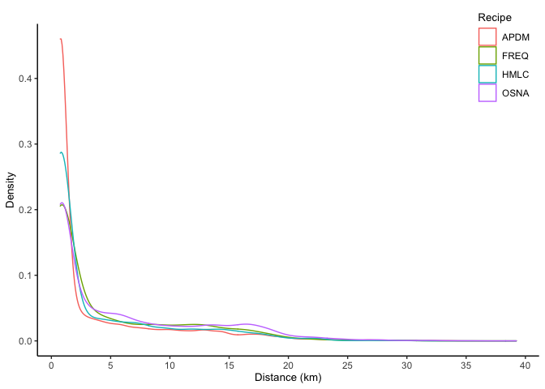

Comparison between original and de-identified datasets
================

The de-identification approach outlined in this research does result in
a loss of both accuracy and precision for the purpose of inferring
meaningful locations. However, we argue that this loss is relatively
inconsequential for many human mobility analyses and is a worthwhile
trade-off vis-a-vis the ethical use of this dataset and any potential
harm that can result from its use.

To evaluate this trade-off, we have applied each of the four algorithms
on both original and de-identified datasets. More than 80% of the users
are labelled with the same home location in both datasets, and the
median ‘error’ for mismatches is less than 2 kilometres for most
algorithms (i.e. a neighbouring hexagon is selected instead).

``` r
grids <- read_sf(here("analysis/data/derived_data/spatial_hex_grid.shp")) 
df_anonymized <- readRDS(here("analysis/data/derived_data/sg_tweets_anonymized_20200929.rds"))
u_ids <- df_anonymized %>% 
  dplyr::select(u_id, u_id_anonymized) %>% 
  distinct(u_id, u_id_anonymized)


#identified home locations from original dataset
raw_hmlc <- readRDS(here::here("analysis/data/raw_data/hm750_hmlc.rds")) %>% mutate(name = "HMLC")
#online social network recipe
raw_osna <- readRDS(here::here("analysis/data/raw_data/hm750_osna.rds")) %>% mutate(name = "OSNA")
#mobile positioning data
raw_apdm <- readRDS(here::here("analysis/data/raw_data/hm750_apdm.rds")) %>% mutate(name = "APDM")
#frequency
raw_freq <- readRDS(here::here("analysis/data/raw_data/hm750_freq.rds")) %>% mutate(name = "FREQ")
hm_original <- bind_rows(raw_hmlc, raw_apdm, raw_osna, raw_freq)


#identified home locations from de-identified dataset
hm_hmlc <- read_csv(here::here("analysis/data/derived_data/hm_hmlc.csv")) 
#online social network recipe
hm_osna <- read_csv(here::here("analysis/data/derived_data/hm_osna.csv"))
#mobile positioning data
hm_apdm <- read_csv(here::here("analysis/data/derived_data/hm_apdm.csv")) 
#frequency
hm_freq <- read_csv(here::here("analysis/data/derived_data/hm_freq.csv")) 
hm_anonymized <- bind_rows(hm_hmlc, hm_apdm, hm_osna, hm_freq)
```

## Percentage of matched identified home locations

``` r
cal_shared_users <- function(raw_hm, anonymized_hm){
  df_joined <- raw_hm %>% 
    dplyr::select(-name) %>% 
    left_join(., u_ids) %>% 
    mutate(home = as.numeric(home)) %>%
    left_join(., anonymized_hm, by = c("u_id_anonymized" = "u_id")) %>% 
    drop_na()
  recipe_nm <- unique(raw_hm$name)
  tibble(
    recipe = recipe_nm,
    n_shared_users = nrow(df_joined), 
    n_matched  = df_joined %>% filter(home.x == home.y) %>% nrow()
  )
}

df_matched <- map2_df(list(raw_apdm, raw_freq, raw_hmlc, raw_osna), list(hm_apdm, hm_freq, hm_hmlc, hm_osna), function(x, y) cal_shared_users(x, y)) %>% 
  mutate(pct_matched = n_matched/n_shared_users * 100)
df_matched %>% 
  rename(Recipe = recipe, `# of shared users` = n_shared_users, `# of matched home locations` = n_matched, `% of matched home locations` = pct_matched) %>% 
  gt::gt() %>% 
  gt::tab_header(
    title = gt::md("Comparison between original and de-identified datasets"),
  )
```

<!--html_preserve-->

<style>html {
  font-family: -apple-system, BlinkMacSystemFont, 'Segoe UI', Roboto, Oxygen, Ubuntu, Cantarell, 'Helvetica Neue', 'Fira Sans', 'Droid Sans', Arial, sans-serif;
}

#ukzafymlyu .gt_table {
  display: table;
  border-collapse: collapse;
  margin-left: auto;
  margin-right: auto;
  color: #333333;
  font-size: 16px;
  background-color: #FFFFFF;
  width: auto;
  border-top-style: solid;
  border-top-width: 2px;
  border-top-color: #A8A8A8;
  border-right-style: none;
  border-right-width: 2px;
  border-right-color: #D3D3D3;
  border-bottom-style: solid;
  border-bottom-width: 2px;
  border-bottom-color: #A8A8A8;
  border-left-style: none;
  border-left-width: 2px;
  border-left-color: #D3D3D3;
}

#ukzafymlyu .gt_heading {
  background-color: #FFFFFF;
  text-align: center;
  border-bottom-color: #FFFFFF;
  border-left-style: none;
  border-left-width: 1px;
  border-left-color: #D3D3D3;
  border-right-style: none;
  border-right-width: 1px;
  border-right-color: #D3D3D3;
}

#ukzafymlyu .gt_title {
  color: #333333;
  font-size: 125%;
  font-weight: initial;
  padding-top: 4px;
  padding-bottom: 4px;
  border-bottom-color: #FFFFFF;
  border-bottom-width: 0;
}

#ukzafymlyu .gt_subtitle {
  color: #333333;
  font-size: 85%;
  font-weight: initial;
  padding-top: 0;
  padding-bottom: 4px;
  border-top-color: #FFFFFF;
  border-top-width: 0;
}

#ukzafymlyu .gt_bottom_border {
  border-bottom-style: solid;
  border-bottom-width: 2px;
  border-bottom-color: #D3D3D3;
}

#ukzafymlyu .gt_col_headings {
  border-top-style: solid;
  border-top-width: 2px;
  border-top-color: #D3D3D3;
  border-bottom-style: solid;
  border-bottom-width: 2px;
  border-bottom-color: #D3D3D3;
  border-left-style: none;
  border-left-width: 1px;
  border-left-color: #D3D3D3;
  border-right-style: none;
  border-right-width: 1px;
  border-right-color: #D3D3D3;
}

#ukzafymlyu .gt_col_heading {
  color: #333333;
  background-color: #FFFFFF;
  font-size: 100%;
  font-weight: normal;
  text-transform: inherit;
  border-left-style: none;
  border-left-width: 1px;
  border-left-color: #D3D3D3;
  border-right-style: none;
  border-right-width: 1px;
  border-right-color: #D3D3D3;
  vertical-align: bottom;
  padding-top: 5px;
  padding-bottom: 6px;
  padding-left: 5px;
  padding-right: 5px;
  overflow-x: hidden;
}

#ukzafymlyu .gt_column_spanner_outer {
  color: #333333;
  background-color: #FFFFFF;
  font-size: 100%;
  font-weight: normal;
  text-transform: inherit;
  padding-top: 0;
  padding-bottom: 0;
  padding-left: 4px;
  padding-right: 4px;
}

#ukzafymlyu .gt_column_spanner_outer:first-child {
  padding-left: 0;
}

#ukzafymlyu .gt_column_spanner_outer:last-child {
  padding-right: 0;
}

#ukzafymlyu .gt_column_spanner {
  border-bottom-style: solid;
  border-bottom-width: 2px;
  border-bottom-color: #D3D3D3;
  vertical-align: bottom;
  padding-top: 5px;
  padding-bottom: 6px;
  overflow-x: hidden;
  display: inline-block;
  width: 100%;
}

#ukzafymlyu .gt_group_heading {
  padding: 8px;
  color: #333333;
  background-color: #FFFFFF;
  font-size: 100%;
  font-weight: initial;
  text-transform: inherit;
  border-top-style: solid;
  border-top-width: 2px;
  border-top-color: #D3D3D3;
  border-bottom-style: solid;
  border-bottom-width: 2px;
  border-bottom-color: #D3D3D3;
  border-left-style: none;
  border-left-width: 1px;
  border-left-color: #D3D3D3;
  border-right-style: none;
  border-right-width: 1px;
  border-right-color: #D3D3D3;
  vertical-align: middle;
}

#ukzafymlyu .gt_empty_group_heading {
  padding: 0.5px;
  color: #333333;
  background-color: #FFFFFF;
  font-size: 100%;
  font-weight: initial;
  border-top-style: solid;
  border-top-width: 2px;
  border-top-color: #D3D3D3;
  border-bottom-style: solid;
  border-bottom-width: 2px;
  border-bottom-color: #D3D3D3;
  vertical-align: middle;
}

#ukzafymlyu .gt_striped {
  background-color: rgba(128, 128, 128, 0.05);
}

#ukzafymlyu .gt_from_md > :first-child {
  margin-top: 0;
}

#ukzafymlyu .gt_from_md > :last-child {
  margin-bottom: 0;
}

#ukzafymlyu .gt_row {
  padding-top: 8px;
  padding-bottom: 8px;
  padding-left: 5px;
  padding-right: 5px;
  margin: 10px;
  border-top-style: solid;
  border-top-width: 1px;
  border-top-color: #D3D3D3;
  border-left-style: none;
  border-left-width: 1px;
  border-left-color: #D3D3D3;
  border-right-style: none;
  border-right-width: 1px;
  border-right-color: #D3D3D3;
  vertical-align: middle;
  overflow-x: hidden;
}

#ukzafymlyu .gt_stub {
  color: #333333;
  background-color: #FFFFFF;
  font-size: 100%;
  font-weight: initial;
  text-transform: inherit;
  border-right-style: solid;
  border-right-width: 2px;
  border-right-color: #D3D3D3;
  padding-left: 12px;
}

#ukzafymlyu .gt_summary_row {
  color: #333333;
  background-color: #FFFFFF;
  text-transform: inherit;
  padding-top: 8px;
  padding-bottom: 8px;
  padding-left: 5px;
  padding-right: 5px;
}

#ukzafymlyu .gt_first_summary_row {
  padding-top: 8px;
  padding-bottom: 8px;
  padding-left: 5px;
  padding-right: 5px;
  border-top-style: solid;
  border-top-width: 2px;
  border-top-color: #D3D3D3;
}

#ukzafymlyu .gt_grand_summary_row {
  color: #333333;
  background-color: #FFFFFF;
  text-transform: inherit;
  padding-top: 8px;
  padding-bottom: 8px;
  padding-left: 5px;
  padding-right: 5px;
}

#ukzafymlyu .gt_first_grand_summary_row {
  padding-top: 8px;
  padding-bottom: 8px;
  padding-left: 5px;
  padding-right: 5px;
  border-top-style: double;
  border-top-width: 6px;
  border-top-color: #D3D3D3;
}

#ukzafymlyu .gt_table_body {
  border-top-style: solid;
  border-top-width: 2px;
  border-top-color: #D3D3D3;
  border-bottom-style: solid;
  border-bottom-width: 2px;
  border-bottom-color: #D3D3D3;
}

#ukzafymlyu .gt_footnotes {
  color: #333333;
  background-color: #FFFFFF;
  border-bottom-style: none;
  border-bottom-width: 2px;
  border-bottom-color: #D3D3D3;
  border-left-style: none;
  border-left-width: 2px;
  border-left-color: #D3D3D3;
  border-right-style: none;
  border-right-width: 2px;
  border-right-color: #D3D3D3;
}

#ukzafymlyu .gt_footnote {
  margin: 0px;
  font-size: 90%;
  padding: 4px;
}

#ukzafymlyu .gt_sourcenotes {
  color: #333333;
  background-color: #FFFFFF;
  border-bottom-style: none;
  border-bottom-width: 2px;
  border-bottom-color: #D3D3D3;
  border-left-style: none;
  border-left-width: 2px;
  border-left-color: #D3D3D3;
  border-right-style: none;
  border-right-width: 2px;
  border-right-color: #D3D3D3;
}

#ukzafymlyu .gt_sourcenote {
  font-size: 90%;
  padding: 4px;
}

#ukzafymlyu .gt_left {
  text-align: left;
}

#ukzafymlyu .gt_center {
  text-align: center;
}

#ukzafymlyu .gt_right {
  text-align: right;
  font-variant-numeric: tabular-nums;
}

#ukzafymlyu .gt_font_normal {
  font-weight: normal;
}

#ukzafymlyu .gt_font_bold {
  font-weight: bold;
}

#ukzafymlyu .gt_font_italic {
  font-style: italic;
}

#ukzafymlyu .gt_super {
  font-size: 65%;
}

#ukzafymlyu .gt_footnote_marks {
  font-style: italic;
  font-size: 65%;
}
</style>

<div id="ukzafymlyu" style="overflow-x:auto;overflow-y:auto;width:auto;height:auto;">

<table class="gt_table">

<thead class="gt_header">

<tr>

<th colspan="4" class="gt_heading gt_title gt_font_normal" style>

Comparison between original and de-identified datasets

</th>

</tr>

<tr>

<th colspan="4" class="gt_heading gt_subtitle gt_font_normal gt_bottom_border" style>

</th>

</tr>

</thead>

<thead class="gt_col_headings">

<tr>

<th class="gt_col_heading gt_columns_bottom_border gt_left" rowspan="1" colspan="1">

Recipe

</th>

<th class="gt_col_heading gt_columns_bottom_border gt_center" rowspan="1" colspan="1">

\# of shared users

</th>

<th class="gt_col_heading gt_columns_bottom_border gt_center" rowspan="1" colspan="1">

\# of matched home locations

</th>

<th class="gt_col_heading gt_columns_bottom_border gt_right" rowspan="1" colspan="1">

% of matched home locations

</th>

</tr>

</thead>

<tbody class="gt_table_body">

<tr>

<td class="gt_row gt_left">

APDM

</td>

<td class="gt_row gt_center">

32047

</td>

<td class="gt_row gt_center">

28944

</td>

<td class="gt_row gt_right">

90.31735

</td>

</tr>

<tr>

<td class="gt_row gt_left">

FREQ

</td>

<td class="gt_row gt_center">

38963

</td>

<td class="gt_row gt_center">

36458

</td>

<td class="gt_row gt_right">

93.57082

</td>

</tr>

<tr>

<td class="gt_row gt_left">

HMLC

</td>

<td class="gt_row gt_center">

24712

</td>

<td class="gt_row gt_center">

23013

</td>

<td class="gt_row gt_right">

93.12480

</td>

</tr>

<tr>

<td class="gt_row gt_left">

OSNA

</td>

<td class="gt_row gt_center">

107094

</td>

<td class="gt_row gt_center">

86961

</td>

<td class="gt_row gt_right">

81.20063

</td>

</tr>

</tbody>

</table>

</div>

<!--/html_preserve-->

## Median shifted distance of identified home locations

``` r
cal_dist_diff <- function(raw_hm, anonymized_hm){
  df_sub <- raw_hm %>% 
    dplyr::select(-name) %>% 
    left_join(., u_ids) %>% 
    mutate(home = as.numeric(home)) %>%
    left_join(., anonymized_hm, by = c("u_id_anonymized" = "u_id")) %>% 
    drop_na() %>% 
    filter(home.x != home.y)  
  
  geom_a <- df_sub %>% 
    left_join(., grids, by = c("home.x" = "grid_id")) %>% 
    st_as_sf() %>% 
    st_centroid()
  
  
  geom_b <- df_sub %>% 
    left_join(., grids, by = c("home.y" = "grid_id")) %>% 
    st_as_sf() %>% 
    st_centroid()
  
  df_sub %>% 
    mutate(diff_dist = st_distance(geom_a, geom_b, by_element = TRUE),
           diff_dist = round(as.numeric(diff_dist)/1000, 2)) %>% 
    mutate(diff_median = median(diff_dist))
}

dist_hmlc <- cal_dist_diff(raw_hmlc, hm_hmlc)
dist_apmd <- cal_dist_diff(raw_apdm, hm_apdm)
dist_osna <- cal_dist_diff(raw_osna, hm_osna)
dist_freq <- cal_dist_diff(raw_freq, hm_freq)

bind_rows(dist_hmlc, dist_apmd, dist_osna, dist_freq) %>% 
  group_by(name) %>% 
  dplyr::summarise(median_dist = median(diff_dist)) %>% 
  rename(Recipe = name, `Median shifted distance (km)` = median_dist) %>% 
  gt::gt() %>% 
  gt::tab_header(
    title = "Median shifted distance of identified home locations",
    subtitle = "Comparison between original and de-identified datasets"
  )
```

<!--html_preserve-->

<style>html {
  font-family: -apple-system, BlinkMacSystemFont, 'Segoe UI', Roboto, Oxygen, Ubuntu, Cantarell, 'Helvetica Neue', 'Fira Sans', 'Droid Sans', Arial, sans-serif;
}

#betxhtbmed .gt_table {
  display: table;
  border-collapse: collapse;
  margin-left: auto;
  margin-right: auto;
  color: #333333;
  font-size: 16px;
  background-color: #FFFFFF;
  width: auto;
  border-top-style: solid;
  border-top-width: 2px;
  border-top-color: #A8A8A8;
  border-right-style: none;
  border-right-width: 2px;
  border-right-color: #D3D3D3;
  border-bottom-style: solid;
  border-bottom-width: 2px;
  border-bottom-color: #A8A8A8;
  border-left-style: none;
  border-left-width: 2px;
  border-left-color: #D3D3D3;
}

#betxhtbmed .gt_heading {
  background-color: #FFFFFF;
  text-align: center;
  border-bottom-color: #FFFFFF;
  border-left-style: none;
  border-left-width: 1px;
  border-left-color: #D3D3D3;
  border-right-style: none;
  border-right-width: 1px;
  border-right-color: #D3D3D3;
}

#betxhtbmed .gt_title {
  color: #333333;
  font-size: 125%;
  font-weight: initial;
  padding-top: 4px;
  padding-bottom: 4px;
  border-bottom-color: #FFFFFF;
  border-bottom-width: 0;
}

#betxhtbmed .gt_subtitle {
  color: #333333;
  font-size: 85%;
  font-weight: initial;
  padding-top: 0;
  padding-bottom: 4px;
  border-top-color: #FFFFFF;
  border-top-width: 0;
}

#betxhtbmed .gt_bottom_border {
  border-bottom-style: solid;
  border-bottom-width: 2px;
  border-bottom-color: #D3D3D3;
}

#betxhtbmed .gt_col_headings {
  border-top-style: solid;
  border-top-width: 2px;
  border-top-color: #D3D3D3;
  border-bottom-style: solid;
  border-bottom-width: 2px;
  border-bottom-color: #D3D3D3;
  border-left-style: none;
  border-left-width: 1px;
  border-left-color: #D3D3D3;
  border-right-style: none;
  border-right-width: 1px;
  border-right-color: #D3D3D3;
}

#betxhtbmed .gt_col_heading {
  color: #333333;
  background-color: #FFFFFF;
  font-size: 100%;
  font-weight: normal;
  text-transform: inherit;
  border-left-style: none;
  border-left-width: 1px;
  border-left-color: #D3D3D3;
  border-right-style: none;
  border-right-width: 1px;
  border-right-color: #D3D3D3;
  vertical-align: bottom;
  padding-top: 5px;
  padding-bottom: 6px;
  padding-left: 5px;
  padding-right: 5px;
  overflow-x: hidden;
}

#betxhtbmed .gt_column_spanner_outer {
  color: #333333;
  background-color: #FFFFFF;
  font-size: 100%;
  font-weight: normal;
  text-transform: inherit;
  padding-top: 0;
  padding-bottom: 0;
  padding-left: 4px;
  padding-right: 4px;
}

#betxhtbmed .gt_column_spanner_outer:first-child {
  padding-left: 0;
}

#betxhtbmed .gt_column_spanner_outer:last-child {
  padding-right: 0;
}

#betxhtbmed .gt_column_spanner {
  border-bottom-style: solid;
  border-bottom-width: 2px;
  border-bottom-color: #D3D3D3;
  vertical-align: bottom;
  padding-top: 5px;
  padding-bottom: 6px;
  overflow-x: hidden;
  display: inline-block;
  width: 100%;
}

#betxhtbmed .gt_group_heading {
  padding: 8px;
  color: #333333;
  background-color: #FFFFFF;
  font-size: 100%;
  font-weight: initial;
  text-transform: inherit;
  border-top-style: solid;
  border-top-width: 2px;
  border-top-color: #D3D3D3;
  border-bottom-style: solid;
  border-bottom-width: 2px;
  border-bottom-color: #D3D3D3;
  border-left-style: none;
  border-left-width: 1px;
  border-left-color: #D3D3D3;
  border-right-style: none;
  border-right-width: 1px;
  border-right-color: #D3D3D3;
  vertical-align: middle;
}

#betxhtbmed .gt_empty_group_heading {
  padding: 0.5px;
  color: #333333;
  background-color: #FFFFFF;
  font-size: 100%;
  font-weight: initial;
  border-top-style: solid;
  border-top-width: 2px;
  border-top-color: #D3D3D3;
  border-bottom-style: solid;
  border-bottom-width: 2px;
  border-bottom-color: #D3D3D3;
  vertical-align: middle;
}

#betxhtbmed .gt_striped {
  background-color: rgba(128, 128, 128, 0.05);
}

#betxhtbmed .gt_from_md > :first-child {
  margin-top: 0;
}

#betxhtbmed .gt_from_md > :last-child {
  margin-bottom: 0;
}

#betxhtbmed .gt_row {
  padding-top: 8px;
  padding-bottom: 8px;
  padding-left: 5px;
  padding-right: 5px;
  margin: 10px;
  border-top-style: solid;
  border-top-width: 1px;
  border-top-color: #D3D3D3;
  border-left-style: none;
  border-left-width: 1px;
  border-left-color: #D3D3D3;
  border-right-style: none;
  border-right-width: 1px;
  border-right-color: #D3D3D3;
  vertical-align: middle;
  overflow-x: hidden;
}

#betxhtbmed .gt_stub {
  color: #333333;
  background-color: #FFFFFF;
  font-size: 100%;
  font-weight: initial;
  text-transform: inherit;
  border-right-style: solid;
  border-right-width: 2px;
  border-right-color: #D3D3D3;
  padding-left: 12px;
}

#betxhtbmed .gt_summary_row {
  color: #333333;
  background-color: #FFFFFF;
  text-transform: inherit;
  padding-top: 8px;
  padding-bottom: 8px;
  padding-left: 5px;
  padding-right: 5px;
}

#betxhtbmed .gt_first_summary_row {
  padding-top: 8px;
  padding-bottom: 8px;
  padding-left: 5px;
  padding-right: 5px;
  border-top-style: solid;
  border-top-width: 2px;
  border-top-color: #D3D3D3;
}

#betxhtbmed .gt_grand_summary_row {
  color: #333333;
  background-color: #FFFFFF;
  text-transform: inherit;
  padding-top: 8px;
  padding-bottom: 8px;
  padding-left: 5px;
  padding-right: 5px;
}

#betxhtbmed .gt_first_grand_summary_row {
  padding-top: 8px;
  padding-bottom: 8px;
  padding-left: 5px;
  padding-right: 5px;
  border-top-style: double;
  border-top-width: 6px;
  border-top-color: #D3D3D3;
}

#betxhtbmed .gt_table_body {
  border-top-style: solid;
  border-top-width: 2px;
  border-top-color: #D3D3D3;
  border-bottom-style: solid;
  border-bottom-width: 2px;
  border-bottom-color: #D3D3D3;
}

#betxhtbmed .gt_footnotes {
  color: #333333;
  background-color: #FFFFFF;
  border-bottom-style: none;
  border-bottom-width: 2px;
  border-bottom-color: #D3D3D3;
  border-left-style: none;
  border-left-width: 2px;
  border-left-color: #D3D3D3;
  border-right-style: none;
  border-right-width: 2px;
  border-right-color: #D3D3D3;
}

#betxhtbmed .gt_footnote {
  margin: 0px;
  font-size: 90%;
  padding: 4px;
}

#betxhtbmed .gt_sourcenotes {
  color: #333333;
  background-color: #FFFFFF;
  border-bottom-style: none;
  border-bottom-width: 2px;
  border-bottom-color: #D3D3D3;
  border-left-style: none;
  border-left-width: 2px;
  border-left-color: #D3D3D3;
  border-right-style: none;
  border-right-width: 2px;
  border-right-color: #D3D3D3;
}

#betxhtbmed .gt_sourcenote {
  font-size: 90%;
  padding: 4px;
}

#betxhtbmed .gt_left {
  text-align: left;
}

#betxhtbmed .gt_center {
  text-align: center;
}

#betxhtbmed .gt_right {
  text-align: right;
  font-variant-numeric: tabular-nums;
}

#betxhtbmed .gt_font_normal {
  font-weight: normal;
}

#betxhtbmed .gt_font_bold {
  font-weight: bold;
}

#betxhtbmed .gt_font_italic {
  font-style: italic;
}

#betxhtbmed .gt_super {
  font-size: 65%;
}

#betxhtbmed .gt_footnote_marks {
  font-style: italic;
  font-size: 65%;
}
</style>

<div id="betxhtbmed" style="overflow-x:auto;overflow-y:auto;width:auto;height:auto;">

<table class="gt_table">

<thead class="gt_header">

<tr>

<th colspan="2" class="gt_heading gt_title gt_font_normal" style>

Median shifted distance of identified home locations

</th>

</tr>

<tr>

<th colspan="2" class="gt_heading gt_subtitle gt_font_normal gt_bottom_border" style>

Comparison between original and de-identified datasets

</th>

</tr>

</thead>

<thead class="gt_col_headings">

<tr>

<th class="gt_col_heading gt_columns_bottom_border gt_left" rowspan="1" colspan="1">

Recipe

</th>

<th class="gt_col_heading gt_columns_bottom_border gt_right" rowspan="1" colspan="1">

Median shifted distance (km)

</th>

</tr>

</thead>

<tbody class="gt_table_body">

<tr>

<td class="gt_row gt_left">

APDM

</td>

<td class="gt_row gt_right">

0.75

</td>

</tr>

<tr>

<td class="gt_row gt_left">

FREQ

</td>

<td class="gt_row gt_right">

1.50

</td>

</tr>

<tr>

<td class="gt_row gt_left">

HMLC

</td>

<td class="gt_row gt_right">

0.75

</td>

</tr>

<tr>

<td class="gt_row gt_left">

OSNA

</td>

<td class="gt_row gt_right">

2.70

</td>

</tr>

</tbody>

</table>

</div>

<!--/html_preserve-->

``` r
bind_rows(dist_hmlc, dist_apmd, dist_osna, dist_freq) %>% 
  ggplot(., aes(diff_dist, color = name)) +
  geom_density(alpha = 0.3) + 
  scale_x_continuous(breaks = seq(0, 50, 5)) +
  labs(x = "Distance (km)", y = "Density", title = "", color = "Recipe") + 
  theme_classic() + 
  theme(title = element_text(size = 10), 
        legend.position = c(0.93, 0.9))
```


